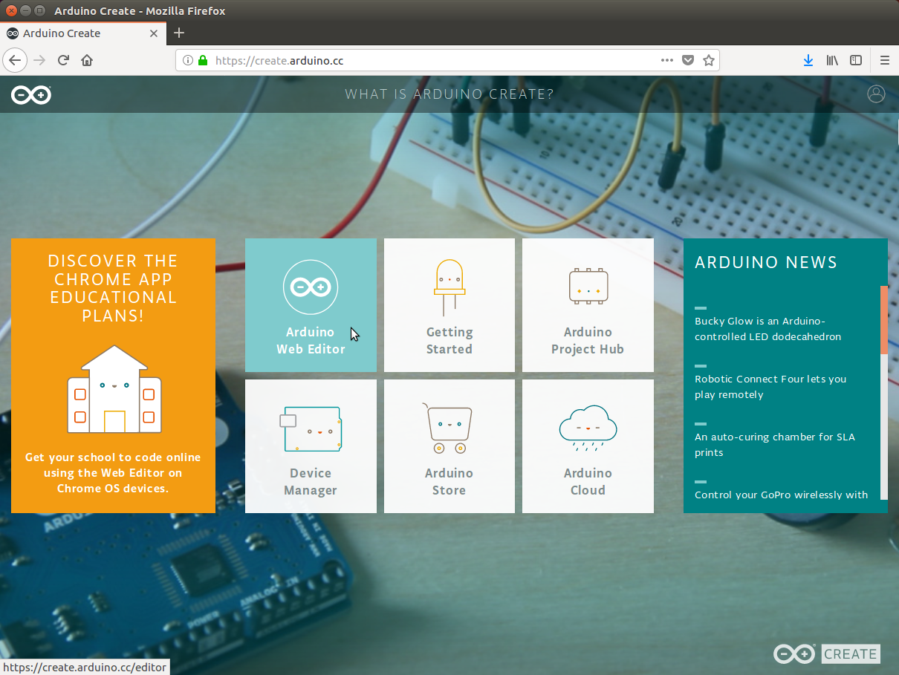
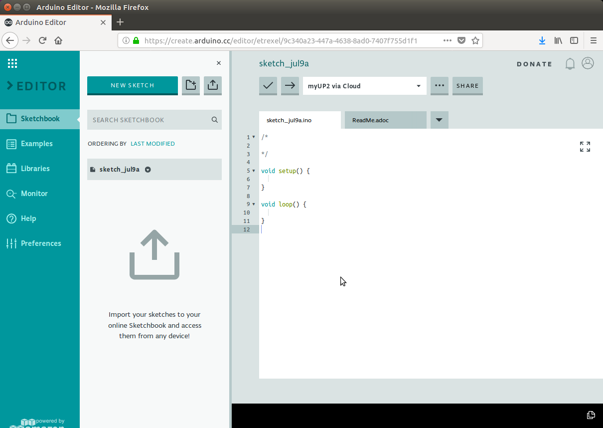
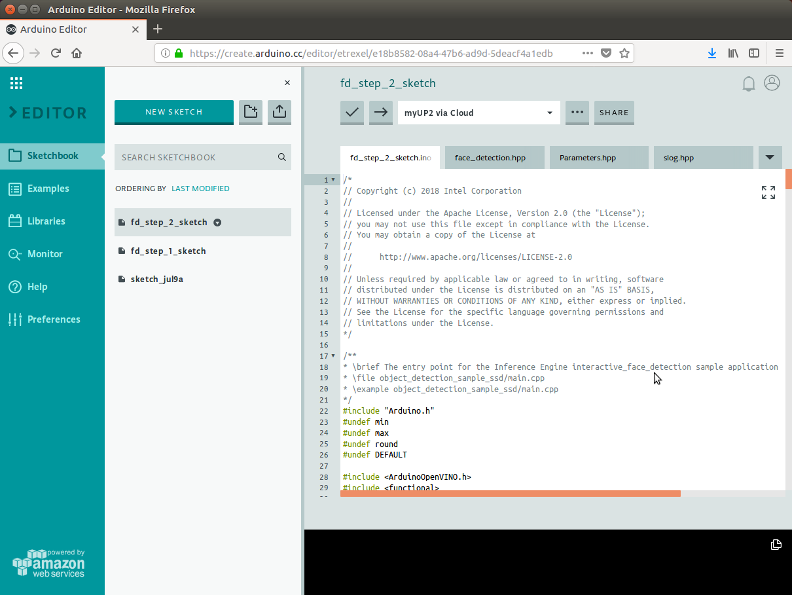
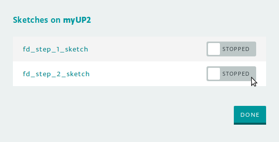
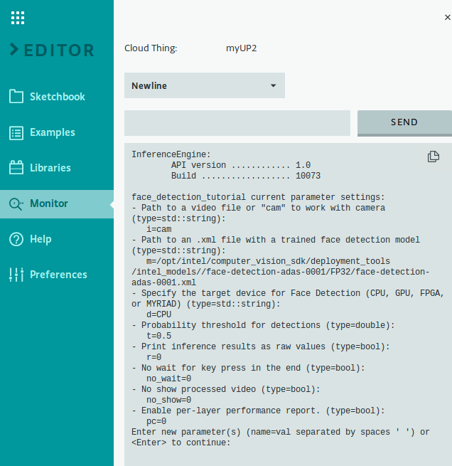
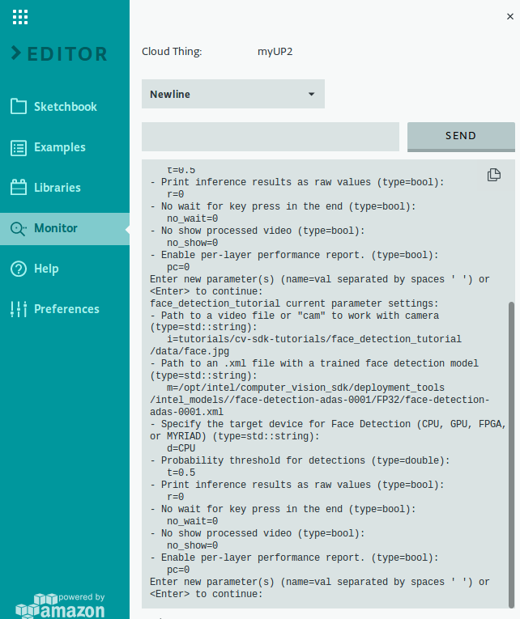
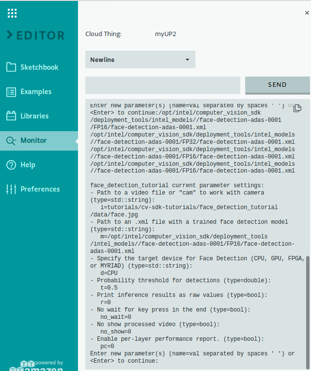
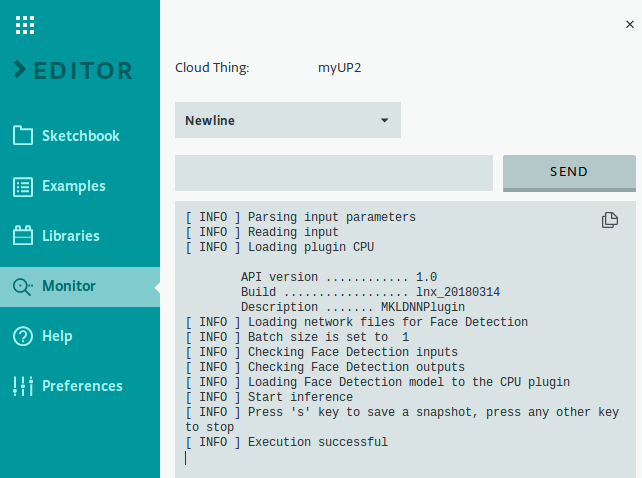

# Tutorial Step 2: Add the first model, Face Detection


# Table of Contents

<p></p><div class="table-of-contents"><ul><li><a href="#tutorial-step-2-add-the-first-model-face-detection">Tutorial Step 2: Add the first model, Face Detection</a></li><li><a href="#table-of-contents">Table of Contents</a></li><li><a href="#introduction">Introduction</a></li><li><a href="#face-detection-models">Face Detection Models</a><ul><li><a href="#how-do-i-specify-which-device-the-model-will-run-on">How Do I Specify Which Device the Model Will Run On?</a><ul><li><a href="#verifying-which-device-is-running-the-model">Verifying Which Device is Running the Model</a></li></ul></li></ul></li><li><a href="#adding-the-face-detection-model">Adding the Face Detection Model</a><ul><li><a href="#helper-functions-and-classes">Helper Functions and Classes</a><ul><li><a href="#matu8toblob">matU8ToBlob</a></li><li><a href="#load">Load</a></li><li><a href="#basedetection-class">BaseDetection Class</a><ul><li><a href="#read">read()</a></li><li><a href="#submitrequest">submitRequest()</a></li><li><a href="#wait">wait()</a></li><li><a href="#enabled">enabled()</a></li><li><a href="#printperformanccount">printPerformancCount()</a></li></ul></li></ul></li><li><a href="#facedetectionclass">FaceDetectionClass</a><ul><li><a href="#submitrequest">submitRequest()</a></li><li><a href="#enqueue">enqueue()</a></li><li><a href="#facedetectionclass">FaceDetectionClass()</a></li><li><a href="#read">read()</a></li><li><a href="#fetchresults">fetchResults()</a></li></ul></li></ul></li><li><a href="#using-facedetectionclass">Using FaceDetectionClass</a><ul><li><a href="#header-files">Header Files</a></li><li><a href="#main-function">main_function()</a></li><li><a href="#main-loop">Main Loop</a></li><li><a href="#post-main-loop">Post-Main Loop</a></li></ul></li><li><a href="#building-and-running">Building and Running</a><ul><li><a href="#build">Build</a><ul><li><a href="#start-arduino-create-web-editor">Start Arduino Create Web Editor</a></li><li><a href="#import-arduino-create-sketch">Import Arduino Create Sketch</a></li><li><a href="#build-and-upload-sketch-executable">Build and Upload Sketch Executable</a></li></ul></li><li><a href="#run">Run</a><ul><li><a href="#how-to-run-the-executable">How to Run the Executable</a></li><li><a href="#how-to-set-runtime-parameters">How to Set Runtime Parameters</a></li><li><a href="#running">Running</a></li></ul></li></ul></li><li><a href="#using-the-hetero-plugin">Using the Hetero Plugin</a><ul><li><a href="#heterogpucpu">HETERO:GPU,CPU</a></li><li><a href="#heterocpugpu">HETERO:CPU,GPU</a></li><li><a href="#heteromyriadcpu">HETERO:MYRIAD,CPU</a></li></ul></li><li><a href="#conclusion">Conclusion</a></li><li><a href="#navigation">Navigation</a></li></ul></div><p></p>

# Introduction

Welcome to the Face Detection Tutorial Step 2.  This is the step of the tutorial where it gets its name by processing image data and detecting faces.  We get this ability by having the application use the Inference Engine to load and run the Intermediate Representation (IR) of a CNN model on the selected hardware device CPU, GPU, or Myriad to perform face detection.  You may recall from the OpenVINO™ toolkit overview, an IR model is a compiled version of a CNN (e.g. from Caffe) that has been optimized using the Model Optimizer for use with the Inference Engine.  This is where we start to see the power of the OpenVINO™ toolkit to load and run models on devices.  In this tutorial step, we will use the Inference Engine to run a pre-compiled model to do face detection on the input image and then output the results.  

A sample output showing the results where a Region of Interest (ROI) box appears around the detected face below.  The metrics reported include the time for OpenCV capture and display along with the time to run the face detection model.  The detected face gets a box around it along with a label as shown below.


# Face Detection Models

The OpenVINO™ toolkit includes two pre-compiled face detection models located at:

* /opt/intel/computer_vision_sdk/deployment_tools/intel_models/face-detection-adas-0001

   * Available model locations:

      * FP16: /opt/intel/computer_vision_sdk/deployment_tools/intel_models/face-detection-adas-0001/FP16/face-detection-adas-0001.xml

      * FP32: /opt/intel/computer_vision_sdk/deployment_tools/intel_models/face-detection-adas-0001/FP32/face-detection-adas-0001.xml

   * More detail may be found the OpenVINO™ toolkit at:       file:///opt/intel/computer_vision_sdk/deployment_tools/intel_models/face-detection-adas-0001/description/face-detection-adas-0001.html

* /opt/intel/computer_vision_sdk/deployment_tools/intel_models/face-detection-retail-0004

   * Available model locations:

      * FP16: /opt/intel/computer_vision_sdk/deployment_tools/intel_models/face-detection-retail-0004/FP16/face-detection-retail-0004.xml

      * FP32: /opt/intel/computer_vision_sdk/deployment_tools/intel_models/face-detection-retail-0004/FP32/face-detection-retail-0004.xml

   * More detail may be found in the OpenVINO™ toolkit at: file:///opt/intel/computer_vision_sdk/deployment_tools/intel_models/face-detection-retail-0004/description/face-detection-retail-0004.html

Each model may be used to perform face detection, the difference is how complex each underlying model is for the results it is capable of producing as shown in the summary below (for more details, see the descriptions HTML pages for each model): 

<table>
  <tr>
    <td>Model</td>
    <td>GFLOPS</td>
    <td>MParameters</td>
    <td>Average Precision</td>
  </tr>
  <tr>
    <td>face-detection-adas-0001</td>
    <td>1.4</td>
    <td>1.1</td>
    <td>AP (head height >64px) 93.1%
AP (head height >100px) 94.1%</td>
  </tr>
  <tr>
    <td>face-detection-retail-0004</td>
    <td>1.067079</td>
    <td>0.58822</td>
    <td>AP (images > 60x60px) 83.00%for </td>
  </tr>
</table>


Note that each model comes pre-compiled for both FP16 and FP32, when choosing which precision always be sure to make sure the hardware device supports it.   

## How Do I Specify Which Device the Model Will Run On?

To make it easier to try different assignments, the application will use command line arguments to specify which device a model is to be run on.  The default device will be the CPU when not set.  Now we will do a brief walkthrough how this is done in the code starting from the command line arguments to the Inference Engine API calls.  Here we are highlighting the specific code, so some code will be skipped over for now to be covered later in other walkthroughs.

To create the command line arguments, the previously mentioned gflags helper library is used to define the arguments for specifying both the face detection model and the device to run it on.  The code appears in "face_detection.hpp":

```cpp
/// @brief message for plugin argument
static const char plugin_message[] = "Plugin name. For example MKLDNNPlugin. If this parameter is pointed, " \
"the sample will look for this plugin only.";

/// \brief Define parameter for face detection  model file <br>
/// It is a required parameter
DEFINE_string(m, "", face_detection_model_message);
```


To create the command line argument: -m \<model-IR-xml-file\>, where \<model-IR-xml-file\> is the face detection model’s .xml file

```bash
/// @brief message for assigning face detection calculation to device
static const char target_device_message[] = "Specify the target device for Face Detection (CPU, GPU, FPGA, or MYRIAD. " \
"Sample will look for a suitable plugin for device specified.";

/// \brief device the target device for face detection infer on <br>
DEFINE_string(d, "CPU", target_device_message);
```


To create the argument: -d \<device\>, where <device> is set to "CPU", "GPU", or "MYRIAD" which we will see conveniently matches what will be passed to the Inference Engine later.

As a result of the macros used in the code above, the variables "PARAMETERS_m" and “PARAMETERS_d” have been created to hold the argument values.  Focusing primarily on how the “PARAMETERS_d” is used to tell the Inference Engine which device to use, we follow the code in “main()” of “main.cpp”:

1. First a map is declared to hold the plugins as they are loaded.  The mapping will allow the associated plugin InferencePlugin object to be found by name (e.g. "CPU")    

```cpp
     // ---------------------Load plugins for inference engine------------------------------------------------
        std::map<std::string, InferencePlugin> pluginsForDevices;
```


2. A vector is used to pair the device and model command line arguments to iterate through them:     

```cpp
   std::vector<std::pair<std::string, std::string>> cmdOptions = {
            {PARAMETERS_d, PARAMETERS_m}
        };
```


3. A loop iterates through device and model the argument pairs:

```cpp
for (auto && option : cmdOptions) {
            auto deviceName = option.first;
            auto networkName = option.second;
```


4. A check is done to make sure the plugin has not already been created and put into the pluginsForDevices map:            

```cpp
 if (pluginsForDevices.find(deviceName) != pluginsForDevices.end()) {
                continue;
            }
```


5. The plugin is created using the Inference Engine’s PluginDispatcher API for the given device’s name.  Here "deviceName" is the value for “PARAMETERS_d” which came directly from the command line argument “-d” which is set to “CPU”, “GPU”, or “MYRIAD”, the exact names the Inference Engine knows for devices.

```cpp
         slog::info << "Loading plugin " << deviceName << slog::endl;
            InferencePlugin plugin = PluginDispatcher({"../../../lib/intel64", ""}).getPluginByDevice(deviceName);
```


6. The plugin details are printed out:

```cpp 
           /** Printing plugin version **/
            printPluginVersion(plugin, std::cout);
```


7. The created plugin is stored to be found by device name later:

```cpp
            pluginsForDevices[deviceName] = plugin;
```


8. Finally the model is loaded passing in the plugin created for the specified device, again using the name given same as it appears on the command line ("Load" class will be described later):

```cpp
       // --------------------Load networks (Generated xml/bin files)-------------------------------------------
        Load(FaceDetection).into(pluginsForDevices[PARAMETERS_d]);
```


### Verifying Which Device is Running the Model

The application will give output saying what Inference Engine plugins (devices) were loaded and which models were loaded on which plugins.

Here is a sample of the output in the console window:

Inference Engine reporting its version:

```bash
InferenceEngine: 
	API version ............ (N.N)
	Build .................. (string)
[ INFO ] Parsing input parameters
[ INFO ] Reading input
```


The application reporting that it is loading the CPU plugin:

```bash
[ INFO ] Loading plugin CPU
```


Inference Engine reports that it has loaded the CPU plugin (MKLDNNPlugin) and its version:

```bash
	API version ............ (N.N)
	Build .................. (string)
	Description ....... MKLDNNPlugin
[ INFO ] Loading network files for Face Detection
[ INFO ] Batch size is set to  1
[ INFO ] Checking Face Detection inputs
[ INFO ] Checking Face Detection outputs
```


The application reporting that it is loading the CPU plugin for the face detection model:

```bash
[ INFO ] Loading Face Detection model to the CPU plugin
[ INFO ] Start inference
```


Later in Tutorial Step 4, we cover loading multiple models onto different devices.  We will also look at how the models perform on different devices.  Until then, we will let all the models load and run on the default CPU device.

# Adding the Face Detection Model

From Tutorial Step 1, we have the base application that can read and display image data, now it is time process the images.  This step of the tutorial expands the capabilities of the application to use the Inference Engine and the face detection model to process images.  To help accomplish this, first we are going to walkthrough the helper functions and classes.  The code may be found in the main.cpp file.

## Helper Functions and Classes

There will need to be a function that takes the input image and turns it into a "blob".  Which begs the question “What is a blob?”  In short, a blob, specifically the class InferenceEngine::Blob, is the data container type used by the Inference Engine for holding input and output data.  To get data into the model, the image data will need to be converted from the OpenCV cv::Mat to an InferenceEngine::Blob.  For doing that is the helper function “matU8ToBlob” in \opt\intel\computer_vision_sdk\inference_engine\samples\common\samples\common.hpp: 

### matU8ToBlob

1. Variables are defined to store the dimensions for the images that the model is optimized to work with.  "blob_data" is assigned to the blob’s data buffer.

```cpp
/**
* @brief Sets image data stored in cv::Mat object to a given Blob object.
* @param orig_image - given cv::Mat object with an image data.
* @param blob - Blob object which to be filled by an image data.
* @param batchIndex - batch index of an image inside of the blob.
*/
template <typename T>
void matU8ToBlob(const cv::Mat& orig_image, InferenceEngine::Blob::Ptr& blob, int batchIndex = 0) {
    InferenceEngine::SizeVector blobSize = blob->getTensorDesc().getDims();
    const size_t width = blobSize[3];
    const size_t height = blobSize[2];
    const size_t channels = blobSize[1];
    T* blob_data = blob->buffer().as<T*>();
```


2. A check is made to see if the input image matches the dimensions of images that the model is expecting.  If the dimensions do not match, then use the OpenCV function cv::resize to resize it.  

```cpp
    cv::Mat resized_image(orig_image);
    if (width != orig_image.size().width || height!= orig_image.size().height) {
        cv::resize(orig_image, resized_image, cv::Size(width, height));
    }
```


3. Now that the image data is the proper size, the data is copied from the input image into the blob’s buffer.  A blob will hold the entire batch for a run through the inference model, so for each batch item first calculate "batchOffset" as an offset into the blob’s buffer before copying the data.

```cpp
    int batchOffset = batchIndex * width * height * channels;

    for (size_t c = 0; c < channels; c++) {
        for (size_t  h = 0; h < height; h++) {
            for (size_t w = 0; w < width; w++) {
                blob_data[batchOffset + c * width * height + h * width + w] =
                    resized_image.at<cv::Vec3b>(h, w)[c];
            }
        }
    }
}
```


For more details on the InferenceEngine::Blob class, see "Understanding Inference Engine Memory primitives" in the documentation: [https://software.intel.com/en-us/articles/OpenVINO-InferEngine](https://software.intel.com/en-us/articles/OpenVINO-InferEngine)

### Load

The helper class "Load" loads the model onto the device to be executed on.  

```cpp
struct Load {
    BaseDetection& detector;
    explicit Load(BaseDetection& detector) : detector(detector) { }

    void into(InferenceEngine::InferencePlugin & plg) const {
        if (detector.enabled()) {
            detector.net = plg.LoadNetwork(detector.read(), {});
            detector.plugin = &plg;
        }
    }
};
```


To help explain how this works, an example using "Load" will be used which looks like:

```cpp
Load(FaceDetection).into(pluginsForDevices[PARAMETERS_d]);
```


The line is read as "Load FaceDetection into the plugin pluginsForDevices[PARAMETERS_d]" which is done as follows:

1. Load(FaceDetection) is a constructor to initialize model object "detector" and returns a “Load” object

2. "into()" is called on the returned object passing in the mapped plugin from “pluginsForDevices”.  The map returns the plugin mapped to “PARAMETERS_d”, which is the command line argument “CPU”, “GPU”, or “MYRIAD”.  The function into() then first checks if the model object is enabled and if it is:

   1. Calls "plg.LoadNetwork(detector.read(),{})"  to load the model returned by “detector.read()” (which we will see later is reading in the model’s IR file) into the plugin.  The resulting object is stored in the model object (detetor.net) 

   2. Sets the model object’s plugin (detector.plugin) to the one used

### BaseDetection Class

Now we are going to walkthrough the BaseDetection class that is used to abstract common features and functionality when using a model which the code also refers to as "detector".  

1. The class is declared and its member variables, the constructor and destructor are defined.  The ExecutableNetwork holds the model that will be used to process the data and make inferences.  The InferencePlugin is the Inference Engine plugin that will be executing the Intermediate Reference on a specific device.  InferRequest is the object that will be used to hold input and output data, start inference, and wait for results.  The name of the model is stored in topoName and the command line argument for the model is stored in commandLineFlag.  Finally, maxBatch is used to set the number of inputs to infer during each run. 

```cpp
struct BaseDetection {
    ExecutableNetwork net;
    InferenceEngine::InferencePlugin * plugin = NULL;
    InferRequest::Ptr request;
    std::string & commandLineFlag;
    std::string topoName;
    const int maxBatch;

    BaseDetection(std::string &commandLineFlag, std::string topoName, int maxBatch)
        : commandLineFlag(commandLineFlag), topoName(topoName), maxBatch(maxBatch) {}

    virtual ~BaseDetection() {}
```


2. The operator -> is overridden for a convenient way to get access to the network.

```cpp
    ExecutableNetwork* operator ->() {
        return &net;
    }
```


#### read()

Since the networks used by the detectors will have different requirements for loading, declare the read() function to be pure virtual.  This ensures that each detector class will have a read function appropriate to the model it will be using.

```cpp
    virtual InferenceEngine::CNNNetwork read()  = 0;
```


#### submitRequest()

The submitRequest() function checks to see if the model is enabled and that there is a valid request to start.  If there is, it requests the model to start running the model asynchronously with startAsync() which returns immediately (we will show how to wait on the results next).

```cpp
    virtual void submitRequest() {
        if (!enabled() || request == nullptr) return;
        request->StartAsync();
    }
```


#### wait()

wait() will wait until results from the model are ready.  First it checks to see if the model is enabled and there is a valid request before actually waiting on the request.

```cpp
    virtual void wait() {
        if (!enabled()|| !request) return;
        request->Wait(IInferRequest::WaitMode::RESULT_READY);
    }
```


#### enabled()

Variables and the enabled() function are defined to track and check if the model is enabled or not.  The model is disabled if "commandLineFlag", the command line argument specifying the model IR .xml file (e.g. “-m”) , has not been set.

```cpp
    mutable bool enablingChecked = false;
    mutable bool _enabled = false;

    bool enabled() const  {
        if (!enablingChecked) {
            _enabled = !commandLineFlag.empty();
            if (!_enabled) {
                slog::info << topoName << " DISABLED" << slog::endl;
            }
            enablingChecked = true;
        }
        return _enabled;
    }
```


#### printPerformancCount()

The printPerformancCount() function checks to see if the detector is enabled, and if it is, then prints out the overall performance statistics for the model.

```cpp
    void printPerformanceCounts() {
        if (!enabled()) {
            return;
        }
        slog::info << "Performance counts for " << topoName << slog::endl << slog::endl;
        ::printPerformanceCounts(request->GetPerformanceCounts(), std::cout, false);
    }
```


## FaceDetectionClass 

Now that we have seen what the base class provides, we will now walkthrough the code for the derived FaceDetectionClass class to see how a model is implemented.

FaceDetectionClass is derived from the BaseDetection class and adding some new member variables that will be needed.

```cpp
struct FaceDetectionClass : BaseDetection {
    std::string input;
    std::string output;
    int maxProposalCount = 0;
    int objectSize = 0;
    int enquedFrames = 0;
    float width = 0;
    float height = 0;
    bool resultsFetched = false;
    std::vector<std::string> labels;
    using BaseDetection::operator=;

    struct Result {
        int label;
        float confidence;
        cv::Rect location;
    };

    std::vector<Result> results;
```


Notice the "Result" struct and the vector “results” that will be used since the face detection model can find more than one face in an image.  Each Result will include a cvRect indicating the location and size of the face in the input image.  It will also have a label and a value indicating the confidence that the result is a face.

### submitRequest()

The submitRequest() function is overridden to make sure there is input data ready and clear out any previous results before calling BaseDetection::submitRequest() to start inference.

```cpp
    void submitRequest() override {
        if (!enquedFrames) return;
        enquedFrames = 0;
        resultsFetched = false;
        results.clear();
        BaseDetection::submitRequest();
    }
```


### enqueue()

A check is made to see that the face detection model is enabled. 

```cpp
    void enqueue(const cv::Mat &frame) {
        if (!enabled()) return;
```


An inference request object is created if one has not been already created.  The request object is used for holding input and output data, starting inference, and waiting for completion and results.

```cpp
        if (!request) {
            request = net.CreateInferRequestPtr();
        }
```


The input blob from the request is retrieved and then matU8ToBlob() is used to copy the image image data into the blob.

```cpp
        width = frame.cols;
        height = frame.rows;

        auto  inputBlob = request->GetBlob(input);
        matU8ToBlob<uint8_t >(frame, inputBlob);
        enquedFrames = 1;
     }
```


### FaceDetectionClass()

On construction of a FaceDetectionClassobject, the base class constructor is called passing in the model to load specified in the command line argument PARAMETERS_m, the name to be used when printing out informational messages, and set the batch size to 1.  This initializes the BaseDetection subclass specifically for FaceDetectionClass class.

```cpp
    FaceDetectionClass() : BaseDetection(PARAMETERS_m, "Face Detection", 1) {}
```


### read()

The next function we will walkthrough is the FaceDetectorClass::read() function which must be specialized specifically to the model that FaceDetectorClass will load and run. 

1. Use the Inference Engine API InferenceEngine::CNNNetReader object to load the model IR files.  This comes from the XML file that is specified on the command line using the "-m" parameter.  

```cpp
    InferenceEngine::CNNNetwork read() override {
        slog::info << "Loading network files for Face Detection" << slog::endl;
        InferenceEngine::CNNNetReader netReader;
        /** Read network model **/
        netReader.ReadNetwork(PARAMETERS_m);
```


2. The maximum batch size is set to the value given in the constructor which is fixed at 1.

```cpp
        /** Set batch size to 1 **/
        slog::info << "Batch size is set to  "<< maxBatch << slog::endl;
        netReader.getNetwork().setBatchSize(maxBatch);
```


3. Names for the model IR .bin file and optional .label file are generated based on the model name from the "-m" parameter.

```cpp
        /** Extract model name and load it's weights **/
        std::string binFileName = fileNameNoExt(PARAMETERS_m) + ".bin";
        netReader.ReadWeights(binFileName);
        /** Read labels (if any)**/
        std::string labelFileName = fileNameNoExt(PARAMETERS_m) + ".labels";

        std::ifstream inputFile(labelFileName);
        std::copy(std::istream_iterator<std::string>(inputFile),
                  std::istream_iterator<std::string>(),
                  std::back_inserter(labels));
```


4. The input data format configured for the proper precision (U8 = 8-bit per BGR channel) and memory layout (NCHW) for the expected model being used.

```cpp
        slog::info << "Checking Face Detection inputs" << slog::endl;
        InferenceEngine::InputsDataMap inputInfo(netReader.getNetwork().getInputsInfo());
        if (inputInfo.size() != 1) {
            throw std::logic_error("Face Detection network should have only one input");
        }
        auto& inputInfoFirst = inputInfo.begin()->second;
        inputInfoFirst->setPrecision(Precision::U8);
        inputInfoFirst->getInputData()->setLayout(Layout::NCHW);
```


5. A check to make sure that there is only one output result defined for the expected model being used. 

```cpp
        slog::info << "Checking Face Detection outputs" << slog::endl;
        InferenceEngine::OutputsDataMap outputInfo(netReader.getNetwork().getOutputsInfo());
        if (outputInfo.size() != 1) {
            throw std::logic_error("Face Detection network should have only one output");
        }
```


6. A check to make sure that the output layers of the model are what are expected.

```cpp
        auto& _output = outputInfo.begin()->second;
        output = outputInfo.begin()->first;

        const auto outputLayer = netReader.getNetwork().getLayerByName(output.c_str());
        if (outputLayer->type != "DetectionOutput") {
            throw std::logic_error("Face Detection network output layer(" + outputLayer->name +
                ") should be DetectionOutput, but was " +  outputLayer->type);
        }

        if (outputLayer->params.find("num_classes") == outputLayer->params.end()) {
            throw std::logic_error("Face Detection network output layer (" +
                output + ") should have num_classes integer attribute");
        }
```


7. Check to make sure that the the number of labels read from the label file match the number of classes in the model.  If not, then clear the labels and do not use them.  

```cpp
        const int num_classes = outputLayer->GetParamAsInt("num_classes");
        if (labels.size() != num_classes) {
            if (labels.size() == (num_classes - 1))  // if network assumes default "background" class, having no label
                labels.insert(labels.begin(), "fake");
            else
                labels.clear();
        }
```


8. A check to make sure that the output the model will return matches as expected.

```cpp
        const InferenceEngine::SizeVector outputDims = _output->dims;
        maxProposalCount = outputDims[1];
        objectSize = outputDims[0];
        if (objectSize != 7) {
            throw std::logic_error("Face Detection network output layer should have 7 as a last dimension");
        }
        if (outputDims.size() != 4) {
            throw std::logic_error("Face Detection network output dimensions not compatible shoulld be 4, but was " + outputDims.size());
        }
```


9. The output format is configured to use the output precision and memory layout that is expect for results from the model being used.

```cpp
        _output->setPrecision(Precision::FP32);
        _output->setLayout(Layout::NCHW);
```


10. Tthe name of the input blob (inputInfo.begin()->first) is saved for later use when getting a blob for input data.  Finally, the InferenceEngine::CNNNetwork object that references this model is returned.

```cpp
        slog::info << "Loading Face Detection model to the "<< PARAMETERS_d << " plugin" << slog::endl;
        input = inputInfo.begin()->first;
        return netReader.getNetwork();
    }
```


### fetchResults()

fetchResults() will parse the inference results saving them in the "Results" variable.

1. Check to make sure that the model is enabled.  If so, clear out any previous results. 

```cpp
    void fetchResults() {
        if (!enabled()) return;
        results.clear();
```


2. Whether results have been fetched are tracked to only fetch once.  submitRequest() resets resultsFetched=false to indicate results have not been fetched yet for each request.

```cpp
        if (resultsFetched) return;
        resultsFetched = true;
```


3. "detections" is set topoint to the inference model output results held in the output blob. 

```cpp
        const float *detections = request->GetBlob(output)->buffer().as<float *>();
```


4. A loop is started to go through the results from the face detection model.  "maxProposalCount" has been set to the maximum number of results that the model can return.  

```cpp
        for (int i = 0; i < maxProposalCount; i++) {
```


5. The loop to retrieve all the results from the output blob buffer.  The output format is determined by the model.  For the face detection model used, the following fields are expected:

   1. Image_id

   2. Label

   3. Confidence 

   4. X coordinate of ROI

   5. Y coordinate of ROI

   6. Width of ROI

   ```cpp
               float image_id = detections[i * objectSize + 0];
               Result r;
               r.label = static_cast<int>(detections[i * objectSize + 1]);
               r.confidence = detections[i * objectSize + 2];
               if (r.confidence <= PARAMETERS_t) {
                   continue;
               }

               r.location.x = detections[i * objectSize + 3] * width;
               r.location.y = detections[i * objectSize + 4] * height;
               r.location.width = detections[i * objectSize + 5] * width - r.location.x;
               r.location.height = detections[i * objectSize + 6] * height - r.location.y;
   ```


6. If the returned image_id is not valid, no more valid outputs are expected so exit the loop.

```cpp
            if (image_id < 0) {
                break;
            }
```


7. A check to see if the application was requested to display the raw information (-r) and print it to the console if necessary.

```cpp
            if (PARAMETERS_r) {
                std::cout << "[" << i << "," << r.label << "] element, prob = " << r.confidence <<
                          "    (" << r.location.x << "," << r.location.y << ")-(" << r.location.width << ","
                          << r.location.height << ")"
                          << ((r.confidence > PARAMETERS_t) ? " WILL BE RENDERED!" : "") << std::endl;
            }
```


8. The populated Result object is added to the vector of results to be used later by the application.

```cpp
            results.push_back(r);
        }
    }
```


See the Inference Engine Development Guide [https://software.intel.com/inference-engine-devguide](https://software.intel.com/inference-engine-devguide) for more information on the steps when using a model with the Inference Engine API.

# Using FaceDetectionClass

We have now seen what happens behind the scenes in the FaceDetectionClass, we will move into the application code and see how it is used.

1. Open up a terminal (such as xterm) or use an existing terminal to get to a command shell prompt.

2. Change to the directory containing Tutorial Step 2:

```bash
cd tutorials/computer-vision-inference-dev-kit-tutorials/face_detection_tutorial/step_2
```


3. Open the files "main.cpp" and “face_detection.hpp” in the editor of your choice such as ‘gedit’, ‘gvim’, or ‘vim’.

## Header Files

1. The first header file to include is necessary to access the Inference Engine API.

```cpp
#include <inference_engine.hpp>
```


2. There are three more headers needed for using the vehicle detection model and the data it gives.

```cpp
#include "face_detection.hpp"
#include "mkldnn/mkldnn_extension_ptr.hpp"
#include <ext_list.hpp>
using namespace InferenceEngine;
```


## main_function()

1. In the main_function() function, there are a map and vector that help make it easier to reference plugins for the Inference Engine. The map stores created plugins to be indexed by the device name of the plugin.  The vector pairs the input models with their corresponding devices using the command line arguments specifying model and device (this was also covered previously while explaining the path from command line to passing which device to use through the Inference Engine API).  Here also instantiates the FaceDetection object of type FaceDetectionClass.

```cpp
std::map<std::string, InferencePlugin> pluginsForDevices;
std::vector<std::pair<std::string, std::string>> cmdOptions = {
   {PARAMETERS_d, PARAMETERS_m}
};

FaceDetectionClass FaceDetection;
```


2. A loop is used to iterate through the device/model pairs and a check is made to see if a plugin for the device already exists.  if not, create the appropriate plugin.  

```cpp
for (auto && option : cmdOptions) {
   auto deviceName = option.first;
   auto networkName = option.second;
   if (deviceName == "" || networkName == "") {
      continue;
   }
   if (pluginsForDevices.find(deviceName) != pluginsForDevices.end()) {
      continue;
   }
```


3. The plugin for the given deviceName is loaded and then its version is reported.

```cpp
   slog::info << "Loading plugin " << deviceName << slog::endl;
   InferencePlugin plugin = PluginDispatcher({"../../../lib/intel64", ""}).getPluginByDevice(deviceName);
   std::cout << plugin.GetVersion() << std::endl << std::endl;
```


4. If loading the CPU plugin, then load the available CPU extensions library.

```cpp
   /** Load extensions for the CPU plugin **/
   if ((deviceName.find("CPU") != std::string::npos)) {
       plugin.AddExtension(std::make_shared<Extensions::Cpu::CpuExtensions>());
   }
```


5. The created plugin is stored into the map pluginsForDevices to be used later when loading the model.

```cpp
   pluginsForDevices[deviceName] = plugin;
}
```


6. The model is loaded into the Inference Engine and associated with the device using the Load helper class previously covered.

```cpp
Load(FaceDetection).into(pluginsForDevices[PARAMETERS_d]);
```


## Main Loop

The main loop in main() is where all the work is done.  Here we walk through the changes made to what it does.  Not all of the code from Tutorial Step 1 is shown.  Please keep in mind that each time through the loop, the application is grabbing an image and storing it in an object named "frame".

1. The code below enqueues the current image and tracks how long it takes.

```cpp
auto t0 = std::chrono::high_resolution_clock::now();
FaceDetection.enqueue(frame);
auto t1 = std::chrono::high_resolution_clock::now();
ocv_decode_time = std::chrono::duration_cast<ms>(t1 - t0).count();
```


2. The face detection model is run to infer the image using submitRequest() then the results are waited on using wait().  The submit-then-wait are enveloped with timing functions to measure how long the inference takes.

```cpp
t0 = std::chrono::high_resolution_clock::now();
FaceDetection.submitRequest();
FaceDetection.wait();
t1 = std::chrono::high_resolution_clock::now();
ms detection = std::chrono::duration_cast<ms>(t1 - t0);
```


3. The inference results are parsed and stored in FaceDetection.results.

```cpp
FaceDetection.fetchResults();
```


4. The statistics are computed for how long each processing step took and that information is printed onto the image.

```cpp
std::ostringstream out;
out << "OpenCV cap/render time: " << std::fixed << std::setprecision(2)
   << (ocv_decode_time + ocv_render_time) << " ms";
cv::putText(frame, out.str(), cv::Point2f(0, 25), cv::FONT_HERSHEY_TRIPLEX, 0.5, cv::Scalar(255, 0, 0));
out.str("");
out << "Face detection time  : " << std::fixed << std::setprecision(2) << detection.count()
   << " ms ("
   << 1000.f / detection.count() << " fps)";
cv::putText(frame, out.str(), cv::Point2f(0, 45), cv::FONT_HERSHEY_TRIPLEX, 0.5, cv::Scalar(255, 0, 0));
```


5. Using OpenCV library calls draw a rectangle around the area that the face detection model determined to be a face along with a label.

```cpp
int i = 0;
for (auto & result : FaceDetection.results) {
   cv::Rect rect = result.location;
   out.str("");
   {
      out << (result.label < FaceDetection.labels.size() ? FaceDetection.labels[result.label] :
         std::string("label #") + std::to_string(result.label))
         << ": " << std::fixed << std::setprecision(3) << result.confidence;
   }
   cv::putText(frame,
                      out.str(),
                      cv::Point2f(result.location.x, result.location.y - 15),
                      cv::FONT_HERSHEY_COMPLEX_SMALL,
                      0.8,
                      cv::Scalar(0, 0, 255));
   auto genderColor =
      cv::Scalar(0, 255, 0);
   cv::rectangle(frame, result.location, genderColor, 2);
   i++;
}
```


6. Finally, the final results for the frame are displayed while measuring the time it took to show the image.

```cpp
t0 = std::chrono::high_resolution_clock::now();
cv::imshow("Detection results", frame);
t1 = std::chrono::high_resolution_clock::now();
ocv_render_time = std::chrono::duration_cast<ms>(t1 - t0).count();
```


## Post-Main Loop

After all the images have been processed (or you have chosen to stop analyzing input from the camera), if the "-pc" command line argument was used, the performance statistics are printed out to the command window and the application is exited.

```cpp
if (PARAMETERS_pc) {
   FaceDetection.printPerformanceCounts();
}
```


# Building and Running

Now that we have looked at the code and understand how the program works, let us compile and run to see it in action.  

## Build

### Start Arduino Create Web Editor

If you do not already have a web browser open, open one such as the Firefox browser from the desktop or from a command line ("firefox &").  Once open, browse to the Arduino website [https://create.arduino.cc/](https://create.arduino.cc/) to begin.

### Import Arduino Create Sketch

1. After going to the Arduino website which should appear similar to below, open the Arduino Web Editor by clicking it.



2. When the editor is first opened, it will show your last opened sketch and appear similar to below.



3. To begin to import this tutorial’s sketch, click on the up-arrow icon (hovering tooltip will say "Import") to the right of the “NEW SKETCH” button as shown below.


4. A "File Upload" window will appear, use it to browse to where the tutorials have been downloaded and select the file “face_detection_tutorial/step_2/fd_step_2_sketch.zip”, and then click the Open button.  After uploading and importing successfully, you will see a window similar to below.  Click the OK button to continue.


5. With the sketch now imported, it will be open in the editor similar to below and you are now ready to build.  



### Build and Upload Sketch Executable

1. From the Arduino Create Web Editor you build the executable and then upload it to your Arduino device.  After uploading, the executable with the same name as the sketch may be found in the "sketches" directory under your user’s home directory and may be run directly from the command line later if desired.  Before continuing, be sure that your device is ready as indicated in the box which will show “\<device name\> via Cloud” when connected as shown below for the device named “myUP2”. 


2. If unconnected and not ready, the device will appear with a line with red ‘X’ before the name as shown below.  To reconnect, you may need to refresh or reload the browser page, restart the Arduino Create Agent, or potentially run setup for your kit again.


3. After making sure your device is connected, to begin the build and upload process click on the right-arrow icon at the top of the editor as shown below.


4. During the build and upload process, you will see that the button has been replaced with "BUSY" as shown below along with status text at the bottom of the window saying “Updating \<sketch name\>”.


5. Below shows after a successful build and upload.  Note that the bottom of the editor will be updated with the status and below it the output of the build.  


6. Uploading will also start the sketch which you can verify by checking the status of the sketch by clicking the "RUN/STOP" button as shown below.


7. The status window will show all the sketches that have been uploaded to the device and the state of each as a "switch" similar below showing either “RUNNING” or “STOPPED”.  Clicking the switch will change the state of the sketch.  


8. For now, we will stop the sketch before continuing.  First click the "RUNNING" to change it to “STOPPED”, then click the DONE button to close the window.  **Note**: Be sure to run only one tutorial sketch at a time to avoid overloading your device which may make it very slow or unresponsive.


## Run

### How to Run the Executable

1. Before starting a sketch, you will need to grant the root user access to the X server to open X windows by executing the following xhost command:

```Bash
xhost +si:localuser:root 
```


2. From the command you should see the following response.  Note the xhost command will need to be run again after rebooting Linux.

```Bash
localuser:root being added to access control list
```


3. After uploading the sketch, it can be started and stopped without re-uploading.  To control and check the status of the sketch, click the "RUN/STOP" button as shown below.


4. The sketch status window will appear with a "switch" to the right of each sketch indicating RUNNING or STOPPED as shown below already STOPPED.  



5. Clicking the RUNNING or STOPPED will change the status between states.  When starting a tutorial exercise, be sure the sketch is stopped first and then start it running.  With the sketch STOPPED, we now click it to change it to RUNNING, then click the DONE button to close the window.  **Note**: Be sure to run only one tutorial sketch at a time to avoid overloading your device which may make it very slow or unresponsive.


### How to Set Runtime Parameters

For flexibility and to minimize rebuilding and re-uploading the sketch when parameters change, the tutorial code allows setting parameters at runtime.  When the sketch first starts, it will first display all the current settings and then prompt for a parameters string before continuing.  Note that the sketch must first stop (or be stopped) and then restarted before accepting new parameter settings.  The steps below go through an example to set the image input parameter "i=\<video filename\>".

1. Open the "Monitor" view by clicking “Monitor” at the left side of the Arduino Create Web Editor.  The monitor is effectively the console for the sketch.  The large box will display output (stdout) from the sketch while the box to the left of the SEND button is used to send input (stdin) to the sketch.  **Note**: Be sure to open the monitor before starting the sketch otherwise you may not see initial output during startup displayed.


2. Stop the sketch if running, then start it again.  The Monitor view should now show the prompt for new parameters similar to below.  Note that each parameter is shown with a description first ("Path to a video file…"), the type of input (“sid::string”), then the current setting as name=val (“i=cam”)..  



3. To change parameters, enter a string "name=val" for each parameter with a space ‘ ‘ between each “name=val”.  To change the video input file, we might use something like “i=tutorials/computer-vision-inference-dev-kit-tutorials/face_detection_tutorial/data/face.jpg” and press Enter or click the SEND button.  The parameters are displayed again with the new setting and a new prompt as shown below.  Note that relative paths are relative to the the user’s home directory where sketches are run.



4. You may notice that default value for the parameter "m" is pretty long and may need to change especially when wanting to use an FP16 model for a device.  To make this easier, included in the tutorial “face_detection.hpp” code are additional parameters: “mFDA32” and “mFDA16”.  Instead of copying the full path, the parameter string’s ability to reference other parameters may be used such as “m=$mFDA16” which will change parameter “m” to now point to the FP16 version of the model as shown below.



5. When ready to run the sketch with the current parameter settings, leave the input box empty and press Enter or click the SEND button.  The sketch should continue with more output shown in the monitor output box similar to below.



### Running

1. You now have an executable file to run.  In order to have it run the face detection model, we need to set the runtime parameters:

   1. "i=\<input-image-or-video-file\>" to specify an input image or video file instead of using the USB camera by default

   2. "=m \<model-xml-file\>"  to specify where to find the module.  For example: -m  /opt/intel/computer_vision_sdk/deployment_tools/intel_models/face-detection-adas-0001/FP32/face-detection-adas-0001.xml”

   3. That is a lot to type and keep straight, so to help make the model names shorter to type and easier to read, let us use the helper parameters in "face_detection.hpp".  The previous setting now becomes “m=$mFDA32”.

2. Again, we will be using images and video files that are included with this tutorial or part of the OpenVINO™ toolkit installation in our sample instructions.  Once you have seen the application working, feel free to try it on your own images and videos.

3. Let us first run it on a single image, to see how it works.  Use the parameter settings string:

```
m=$mFDA32 i=tutorials/computer-vision-inference-dev-kit-tutorials/face_detection_tutorial/data/face.jpg
```


4. You will now see an output window open up with the image displayed.  Over the image, you will see text with the statistics of how long it took to perform the OpenCV input and output and model processing time.  You should also see a rectangle drawn around the face in the image that has been labeled with an instance number and confidence value.

5. Let us see how the application handles a video file.  And let us also see how easy it is to have the application run a different face detection model by loading the face-detection-retail-0004 IR files by just changing the "m=" parameter from $mFDA32 to $mFDR32.  Use the parameter settings string:

```
m=$mFDR32 i=tutorials/computer-vision-inference-dev-kit-tutorials/face_detection_tutorial/data/head-pose-face-detection-female-and-male.mp4
```


6. Now, you should see a window open, playing the video.  Over each frame of the video, you will see a rectangle drawn around the face.  As the face moves around the image, the rectangle will follow it.

7. Finally, let us see how the application works with the camera input.  The camera is the default source, so we do this by running the application without using any parameters or we can still specify the camera using "cam" by using the parameter settings string:

```
m=$mFDA32 i=cam
```


8. Now you will see a window displaying the input from the USB camera.  The performance statistics appear over the image, as the application processes each frame.  If there is a face in the image, you will see a rectangle surrounding the face with label and confidence value.  The rectangle will follow the face around the image as it moves and will change sizes to fit the face.

9. When you want to exit the program, make sure the output window is active and press a key.  The output window will close.

10. You may remember the final step of the code walk-through, where we showed a step that printed out Performance Counts for the application.  This only happens if you specify the "-pc" command line option.  Let us run the application one more time to see what kind of output we get from printing those counts.  Use the parameter settings string:

```
m=$mFDA32 i=cam pc=1
```


11. When you exit the application this time, you will notice that the Monitor is updated with the final statistics from the face detection model.  The extra output shows a detailed list of the various analysis steps the model performed during the last request (Note only one, not all of them for video) and how long the model spent on each step.  At the bottom of the list, it displays the total time spent performing the face inference.

```bash
InferenceEngine: 
	API version ............ (N.N)
	Build .................. (string)
[ INFO ] Parsing input parameters
[ INFO ] Reading input
[ INFO ] Loading plugin CPU

	API version ............ (N.N)
	Build .................. (string)
	Description ....... MKLDNNPlugin

[ INFO ] Loading network files for Face Detection
[ INFO ] Batch size is set to  1
[ INFO ] Checking Face Detection inputs
[ INFO ] Checking Face Detection outputs
[ INFO ] Loading Face Detection model to the CPU plugin
[ INFO ] Start inference 
[ INFO ] Press 's' key to save a snapshot, press any other key to stop
[ INFO ] Press 's' key to save a snapshot, press any other key to exit
[ INFO ] Performance counts for Face Detection

Mul_788/Fused_Mul_1070/Fus... EXECUTED       layerType: ScaleShift         realTime: 946        cpu: 946            execType: unknown
conv1                         EXECUTED       layerType: Convolution        realTime: 2586       cpu: 2586           execType: jit_sse42
conv2_1/dw                    EXECUTED       layerType: Convolution        realTime: 1484       cpu: 1484           execType: jit_sse42_dw
conv2_1/sep                   EXECUTED       layerType: Convolution        realTime: 5594       cpu: 5594           execType: jit_sse42_1x1
conv2_2/dw                    EXECUTED       layerType: Convolution        realTime: 1860       cpu: 1860           execType: jit_sse42_dw
Total time: 91233    microseconds
[ INFO ] Execution successful
```


12. Above, is part of the output you will see in your console window.  It shows information on what the Inference Engine loaded, followed by the performance statistics gathered from running each layer within the model.  This includes the calculation run, the model layer type, the real time spent performing the calculation, the CPU time spent performing the calculation, and the type of calculation that was performed.  In this instance, since we loaded the model onto the CPU, the "realTime" and “cpu” time values are the same.  The last bit of information we see is the total time spent spent performing the face analysis.  In this example it was 91233 microseconds, or 0.091233 seconds.

# Using the Hetero Plugin

As described earlier in the tutorial, the Hetero Plugin is used to run the layers of an inference model on multiple devices.  The Hetero Plugin and device list to use are specified using the device name "HETERO:\<1st device\>[,\<2nd device\>][,\<3rd device\>]..." which will assign layers to the first device with direct support and any remaining less supported layers fall back to the last device.  Let us now run a few examples to see working.

## HETERO:GPU,CPU

Here we run the combination with the GPU as the primary device and falling back to the CPU. 

```
m=$mFDA32 i=tutorials/computer-vision-inference-dev-kit-tutorials/face_detection_tutorial/data/face.jpg pc=1 d=HETERO:GPU,CPU
```


Once the image appears, press any key in the output window to exit.  As the application exits, the "-pc" argument will cause it to output the performance counts for the face detection model.  At the top of the performance output you should see something similar to below.  Note the “execType” field where it is specifies “N5cldnn3gpu*” which indicates clDNN library functions and that the GPU plugin executed the layer.

```
subgraph1: Mul1_/Fused_Mul... EXECUTED       layerType: ScaleShift         realTime: 2643       cpu: 14             execType: N5cldnn3gpu9scale_gpuE
subgraph1: conv1              EXECUTED       layerType: Convolution        realTime: 6943       cpu: 14             execType: N5cldnn3gpu15convolution_gpuE
subgraph1: conv2_1/dw         EXECUTED       layerType: Convolution        realTime: 16628      cpu: 13             execType: N5cldnn3gpu15convolution_gpuE
subgraph1: conv2_1/sep        EXECUTED       layerType: Convolution        realTime: 13850      cpu: 17             execType: N5cldnn3gpu15convolution_gpuE
subgraph1: conv2_2/dw         EXECUTED       layerType: Convolution        realTime: 6050       cpu: 14             execType: N5cldnn3gpu15convolution_gpuE
subgraph1: conv2_2/sep        EXECUTED       layerType: Convolution        realTime: 7769       cpu: 14             execType: N5cldnn3gpu15convolution_gpuE
subgraph1: conv3_1/dw         EXECUTED       layerType: Convolution        realTime: 9984       cpu: 13             execType: N5cldnn3gpu15convolution_gpuE
subgraph1: conv3_1/sep        EXECUTED       layerType: Convolution        realTime: 7724       cpu: 18             execType: N5cldnn3gpu15convolution_gpuE
subgraph1: conv3_2/dw         EXECUTED       layerType: Convolution        realTime: 2845       cpu: 14             execType: N5cldnn3gpu15convolution_gpuE
```


## HETERO:CPU,GPU

Here we run the combination with the CPU as the primary device and falling back to the GPU. 

```
m=$mFDA32 i=tutorials/computer-vision-inference-dev-kit-tutorials/face_detection_tutorial/data/face.jpg pc=1 d=HETERO:CPU,GPU
```


Once the image appears, press any key in the output window to exit.  As the application exits, the "-pc" argument will cause it to output the performance counts for the face detection model.  At the top of the performance output you should see something similar to below.  Note the “execType” field where it is specifies “jit_sse*” which indicates that the CPU plugin executed the layer.  You may also notice that there are no “N5cldnn3gpu*” which would indicate execution on the GPU.  This is because the CPU plugin was able to support all the layers present. 

```
subgraph1: Mul1_/Fused_Mul... EXECUTED       layerType: ScaleShift         realTime: 328        cpu: 328            execType: jit_sse42
subgraph1: conv1              EXECUTED       layerType: Convolution        realTime: 2307       cpu: 2307           execType: jit_sse42
subgraph1: conv2_1/dw         EXECUTED       layerType: Convolution        realTime: 1600       cpu: 1600           execType: jit_sse42_dw
subgraph1: conv2_1/sep        EXECUTED       layerType: Convolution        realTime: 5075       cpu: 5075           execType: jit_sse42_1x1
subgraph1: conv2_2/dw         EXECUTED       layerType: Convolution        realTime: 2772       cpu: 2772           execType: jit_sse42_dw
subgraph1: conv2_2/sep        EXECUTED       layerType: Convolution        realTime: 5287       cpu: 5287           execType: jit_sse42_1x1
subgraph1: conv3_1/dw         EXECUTED       layerType: Convolution        realTime: 1413       cpu: 1413           execType: jit_sse42_dw
subgraph1: conv3_1/sep        EXECUTED       layerType: Convolution        realTime: 11378      cpu: 11378          execType: jit_sse42_1x1
subgraph1: conv3_2/dw         EXECUTED       layerType: Convolution        realTime: 990        cpu: 990            execType: jit_sse42_dw
```


## HETERO:MYRIAD,CPU

Here we run the combination with the Myriad as the primary device and falling back to the CPU. 

```
m=$mFDA16 i=tutorials/computer-vision-inference-dev-kit-tutorials/face_detection_tutorial/data/face.jpg pc=1 d=HETERO:MYRIAD,CPU
```


Once the image appears, press any key in the output window to exit.  As the application exits, the "-pc" argument will cause it to output the performance counts for the face detection model.  At the top of the performance output you should see something similar to below.  Note the “execType” field where it is specifies the same name as the “layerType” field (e.g. “ScaleShift”) which indicates the MYRIAD plugin executed the layer.  

```
subgraph1: Mul1_/Fused_Mul... EXECUTED       layerType: ScaleShift         realTime: 4319       cpu: 4319           execType: ScaleShift
subgraph1: conv1              EXECUTED       layerType: Convolution        realTime: 3141       cpu: 3141           execType: Convolution
subgraph1: conv1@biases       OPTIMIZED_OUT  layerType: Bias               realTime: 0          cpu: 0              execType: Bias
subgraph1: conv2_1/dw         EXECUTED       layerType: DepthConvolution   realTime: 3357       cpu: 3357           execType: DepthConvolution
subgraph1: conv2_1/dw@biases  OPTIMIZED_OUT  layerType: Bias               realTime: 0          cpu: 0              execType: Bias
subgraph1: conv2_1/sep        EXECUTED       layerType: Convolution        realTime: 4213       cpu: 4213           execType: Convolution
subgraph1: conv2_1/sep@biases OPTIMIZED_OUT  layerType: Bias               realTime: 0          cpu: 0              execType: Bias
subgraph1: conv2_2/dw         EXECUTED       layerType: DepthConvolution   realTime: 3499       cpu: 3499           execType: DepthConvolution
subgraph1: conv2_2/dw@biases  OPTIMIZED_OUT  layerType: Bias               realTime: 0          cpu: 0              execType: Bias
subgraph1: conv2_2/sep        EXECUTED       layerType: Convolution        realTime: 3399       cpu: 3399           execType: Convolution
subgraph1: conv2_2/sep@biases OPTIMIZED_OUT  layerType: Bias               realTime: 0          cpu: 0              execType: Bias
subgraph1: conv3_1/dw         EXECUTED       layerType: DepthConvolution   realTime: 3650       cpu: 3650           execType: DepthConvolution
subgraph1: conv3_1/dw@biases  OPTIMIZED_OUT  layerType: Bias               realTime: 0          cpu: 0              execType: Bias
subgraph1: conv3_1/sep        EXECUTED       layerType: Convolution        realTime: 6747       cpu: 6747           execType: Convolution
subgraph1: conv3_1/sep@biases OPTIMIZED_OUT  layerType: Bias               realTime: 0          cpu: 0              execType: Bias
subgraph1: conv3_2/dw         EXECUTED       layerType: DepthConvolution   realTime: 1888       cpu: 1888           execType: DepthConvolution
```


# Conclusion

Congratulations on using a CNN model to detect faces!  You have now seen that the process can be done quite quickly.  The classes and helper functions that we added here are aimed at making it easy to add more models to the application by following the same pattern.  We will see it again in action in Step 3, when we add an age and gender inferring model, and then again in Step 4, when we add head pose estimation.

# Navigation

[Face Detection Tutorial](../Readme.md)

[Face Detection Tutorial Step 1](../step_1/Readme.md)

[Face Detection Tutorial Step 3](../step_3/Readme.md)

