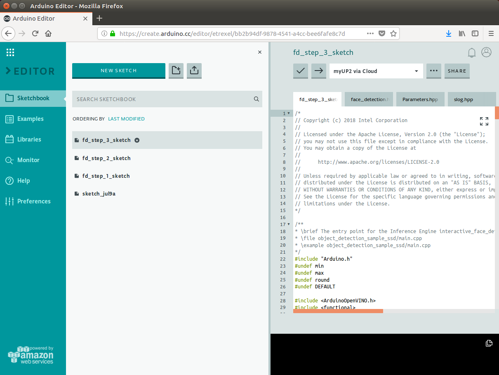
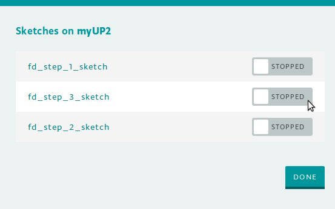
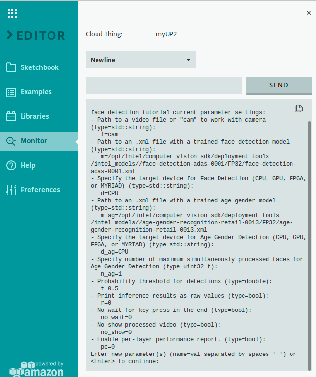
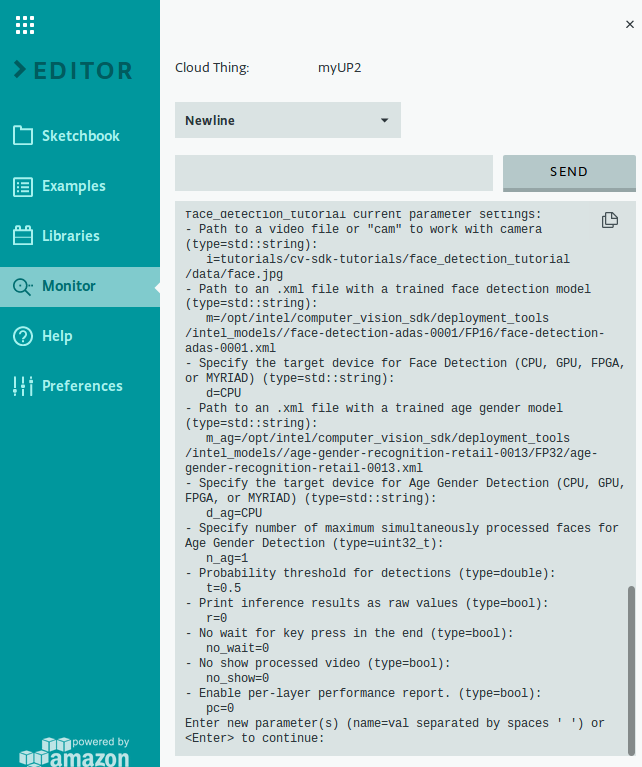
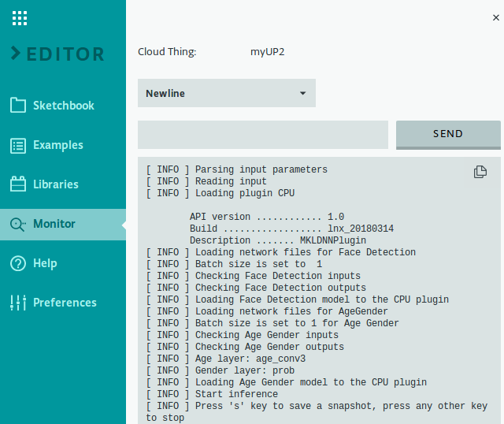

# Tutorial Step 3: Add a second model, Age and Gender Detection


# Table of Contents

<p></p><div class="table-of-contents"><ul><li><a href="#tutorial-step-3-add-a-second-model-age-and-gender-detection">Tutorial Step 3: Add a second model, Age and Gender Detection</a></li><li><a href="#table-of-contents">Table of Contents</a></li><li><a href="#introduction">Introduction</a></li><li><a href="#age-and-gender-detection-model">Age and Gender Detection Model</a></li><li><a href="#adding-the-age-and-gender-detection-model">Adding the Age and Gender Detection Model</a><ul><li><a href="#agegenderdetection">AgeGenderDetection</a><ul><li><a href="#agegenderdetection">AgeGenderDetection()</a></li><li><a href="#submitrequest">submitRequest()</a></li><li><a href="#enqueue">enqueue()</a></li><li><a href="#read">read()</a></li></ul></li></ul></li><li><a href="#using-agegenderdetection">Using AgeGenderDetection</a><ul><li><a href="#main-function">main_function()</a></li><li><a href="#main-loop">Main Loop</a></li><li><a href="#post-main-loop">Post-Main Loop</a></li></ul></li><li><a href="#building-and-running">Building and Running</a><ul><li><a href="#build">Build</a><ul><li><a href="#start-arduino-create-web-editor">Start Arduino Create Web Editor</a></li><li><a href="#import-arduino-create-sketch">Import Arduino Create Sketch</a></li><li><a href="#build-and-upload-sketch-executable">Build and Upload Sketch Executable</a></li></ul></li><li><a href="#run">Run</a><ul><li><a href="#how-to-run-the-executable">How to Run the Executable</a></li><li><a href="#how-to-set-runtime-parameters">How to Set Runtime Parameters</a></li><li><a href="#running">Running</a></li></ul></li></ul></li><li><a href="#conclusion">Conclusion</a></li><li><a href="#navigation">Navigation</a></li></ul></div><p></p>

# Introduction

Welcome to Face Detection Tutorial Step 3.  Now that the application can detect faces in images, we now want the application to estimate the age and gender for each face.  The precompiled "age-gender-recognition-retail-0013" model included with the OpenVINO™ toolkit that we will be running was trained on approximately 20,000 faces.  When it sees a face within 45 degrees (left, right, above, or below) of straight-on, it is 96.6% accurate on determining gender.  It can also determine ages to within 6 years, on average.  A sample output showing the results where the ROI box is now labeled “[M|F],<age>” appears below.  The metrics reported now also include the time to run the age and gender model.


# Age and Gender Detection Model

The OpenVINO™ toolkit provides a pre-compiled model for estimating age and gender from an image of a face.  You can find it at:

* /opt/intel/computer_vision_sdk/deployment_tools/intel_models/age-gender-recognition-retail-0013

   * Available model locations:

      * FP16: /opt/intel/computer_vision_sdk/deployment_tools/intel_models/age-gender-recognition-retail-0013/FP16/age-gender-recognition-retail-0013.xml

      * FP32: /opt/intel/computer_vision_sdk/deployment_tools/intel_models/age-gender-recognition-retail-0013/FP32/age-gender-recognition-retail-0013.xml

   * More details can be found at:

      * file:///opt/intel/computer_vision_sdk/deployment_tools/intel_models/age-gender-recognition-retail-0013/description/age-gender-recognition-retail-0013.html

The results it is capable of producing are shown in the summary below (for more details, see the descriptions HTML pages for each model): 

<table>
  <tr>
    <td>Model</td>
    <td>GFLOPS</td>
    <td>MParameters</td>
    <td>Average Precision</td>
  </tr>
  <tr>
    <td>age-gender-recognition-retail-0013</td>
    <td>0.094</td>
    <td>2.138</td>
    <td>Avg. age error: 6.07 years
Gender accuracy: 96.66%</td>
  </tr>
</table>


# Adding the Age and Gender Detection Model

Thanks to the setup work done in Tutorial Step 2, adding the age and gender detection model in this step will just be a matter of deriving a new class from the BaseDetection class, adding an additional command line argument to specify the new model, and updating the application to run and track the statistics for the new model.  This means there will not be as much code to walk through this time.  That will let us focus on how to pass the important image inference results from the face detection model to the age and gender detection model.

1. Open up a terminal (such as xterm) or use an existing terminal to get to a command shell prompt.

2. Change to the directory containing Tutorial Step 3:

```bash
cd tutorials/face_detection_tutorial/step_3
```


3. Open the files "main.cpp" and “face_detection.hpp” in the editor of your choice such as ‘gedit’, ‘gvim’, or ‘vim’.

## AgeGenderDetection

1. The AgeGenderDetection class is derived from BaseDetection and the member variables it uses are declared.

```cpp
struct AgeGenderDetection : BaseDetection {
    std::string input;
    std::string outputAge;
    std::string outputGender;
    int enquedFaces = 0;
```


2. The Result class is used to store the information that the model returns, specifically, the age of the face and the probability that it is a male or female face.

```Cpp
    struct Result { float age; float maleProb;};
```


3. The operator[] function is defined to give a convenient way to retrieve the age and gender results from the data contained in the inference request’s output blob.  The index to the appropriate locations in the blob are calculated for the batch item.  A result object is returned containing the data read for the batch index.

```cpp
    Result operator[] (int idx) const {
        auto  genderBlob = request->GetBlob(outputGender);
        auto  ageBlob    = request->GetBlob(outputAge);

        return {ageBlob->buffer().as<float*>()[idx] * 100,
                genderBlob->buffer().as<float*>()[idx * 2 + 1]};
    }
```


### AgeGenderDetection()

On construction of a AgeGenderDetection object, the base class constructor is called passing in the model to load specified in the command line argument PARAMETERS_m_ag, the name to be used when we printing out informational messages, and set the batch size to the command line argument FLAFS_n_ag.  This initializes the BaseDetection subclass specifically for AgeGenderDetection.

```cpp
    AgeGenderDetection() : BaseDetection(PARAMETERS_m_ag, "Age Gender", PARAMETERS_n_ag) {}
```


### submitRequest()

The submitRequest() function is overridden to make sure that there are faces queued up to be processed before calling the base class submitRequest() function to start inferring vehicle attributes from the enqueued faces.  enquedFaces is reset to 0 to indicate that all the queued data has been submitted.

```cpp
    void submitRequest() override {
        if (!enquedFaces) return;
        BaseDetection::submitRequest();
        enquedFaces = 0;
    }
```


### enqueue()

A check is made to see that the age and gender detection model is enabled.  A check is also made to make sure that the number of inputs does not exceed the batch size.  

```cpp
    void enqueue(const cv::Mat &face) {
        if (!enabled()) {
            return;
        }
        if (enquedFaces == maxBatch) {
            slog::warn << "Number of detected faces more than maximum(" << maxBatch << ") processed by Age Gender detector" << slog::endl;
            return;
        }
```


An inference request object is created if one has not been already been created.  The request object is used for holding input and output data, starting inference, and waiting for completion and results.

```cpp
        if (!request) {
            request = net.CreateInferRequestPtr();
        }
```


The input blob from the request is retrieved and then matU8ToBlob() is used to copy the image image data into the blob.

```cpp
        auto  inputBlob = request->GetBlob(input);

        if (matU8ToBlob<float>(face, inputBlob, 1.0f, enquedFaces)) {
        	enquedFaces++;
        }
    }
```


### read()

The next function we will walkthrough is the AgeGenderDetection::read() function which must be specialized specifically to the model that it will load and run. 

1. The Inference Engine API InferenceEngine::CNNNetReader object is used to load the model IR files.  This comes from the XML file that is specified on the command line using the "-m_ag" parameter.  

```cpp
    CNNNetwork read() override {
        slog::info << "Loading network files for AgeGender" << slog::endl;
        InferenceEngine::CNNNetReader netReader;
        /** Read network model **/
        netReader.ReadNetwork(PARAMETERS_m_ag);
```


2. The maximum batch size is set to maxBatch (set using PARAMETERS_n_ag which defaults to 1).

```cpp
        /** Set batch size **/
        netReader.getNetwork().setBatchSize(maxBatch);
        slog::info << "Batch size is set to " << netReader.getNetwork().getBatchSize() << " for Age Gender" << slog::endl;
```


3. The IR .bin file of the model is read.

```cpp
        /** Extract model name and load it's weights **/
        std::string binFileName = fileNameNoExt(PARAMETERS_m_ag) + ".bin";
        netReader.ReadWeights(binFileName);
```


4. The proper number of inputs is checked to make sure that the loaded model has only one input as expected.

```cpp
        slog::info << "Checking Age Gender inputs" << slog::endl;
        InferenceEngine::InputsDataMap inputInfo(netReader.getNetwork().getInputsInfo());
        if (inputInfo.size() != 1) {
            throw std::logic_error("Age gender topology should have only one input");
        }
```


5. The input data format is prepared by configuring it for the proper precision (FP32 = 32-bit floating point) and memory layout (NCHW) for the model.

```cpp
        auto& inputInfoFirst = inputInfo.begin()->second;
        inputInfoFirst->setPrecision(Precision::FP32);
        inputInfoFirst->getInputData()->setLayout(Layout::NCHW);
        input = inputInfo.begin()->first;
```


6. The model is verified to have the two output layers as expected for the age and gender results.  Variables are created and initialized to hold the output names to receive the results from the model.

```cpp
        slog::info << "Checking Age Gender outputs" << slog::endl;
        InferenceEngine::OutputsDataMap outputInfo(netReader.getNetwork().getOutputsInfo());
        if (outputInfo.size() != 2) {
            throw std::logic_error("Age Gender network should have two output layers");
        }
        auto it = outputInfo.begin();
        auto ageOutput = (it++)->second;
        auto genderOutput = (it++)->second;
```


7. A check is made to make sure that the model has the output layer types expected and output layers are swapped as necessary for receiving the age and the gender results.

```cpp
        // if gender output is convolution, it can be swapped with age
        if (genderOutput->getCreatorLayer().lock()->type == "Convolution") {
            std::swap(ageOutput, genderOutput);
        }

        if (ageOutput->getCreatorLayer().lock()->type != "Convolution") {
            throw std::logic_error("In Age Gender network, age layer (" + ageOutput->getCreatorLayer().lock()->name +
                ") should be a Convolution, but was: " + ageOutput->getCreatorLayer().lock()->type);
        }

        if (genderOutput->getCreatorLayer().lock()->type != "SoftMax") {
            throw std::logic_error("In Age Gender network, gender layer (" + genderOutput->getCreatorLayer().lock()->name +
                ") should be a SoftMax, but was: " + genderOutput->getCreatorLayer().lock()->type);
        }
```


8. The names of the two output layers are logged and saved into variables used to retrieve results later.

```cpp
        slog::info << "Age layer: " << ageOutput->getCreatorLayer().lock()->name<< slog::endl;
        slog::info << "Gender layer: " << genderOutput->getCreatorLayer().lock()->name<< slog::endl;

        outputAge = ageOutput->name;
        outputGender = genderOutput->name;
```


9. Where the model will be loaded is logged, the model is marked as being enabled, and the InferenceEngine::CNNNetwork object containing the model is returned.

```cpp
        slog::info << "Loading Age Gender model to the "<< PARAMETERS_d_ag << " plugin" << slog::endl;
        _enabled = true;
        return netReader.getNetwork();
    }
};
```


# Using AgeGenderDetection

That takes care of specializing the BaseDetector class into the AgeGenderDetection class for the age and gender detection model.  We now move down into the main() function to see what additions have been made to use the age and gender detection model to process detected faces.

## main_function()

1. In the main_function() function, the command line arguments PARAMETERS_d_ag and PARAMETERS_m_ag are added to cmdOptions.  Remember that the flags are defined in the face_detection.hpp file.

```cpp
std::vector<std::pair<std::string, std::string>> cmdOptions = {
   {PARAMETERS_d, PARAMETERS_m}, {PARAMETERS_d_ag, PARAMETERS_m_ag}
};
```


2. The age and gender detection object is instantiated.

```cpp
AgeGenderDetection AgeGender;
```


3. The model is loaded into the Inference Engine and associated with the device using the Load helper class previously covered.

```cpp
Load(AgeGender).into(pluginsForDevices[PARAMETERS_d_ag]);
```


## Main Loop

In the main "while(true)" loop, the inference results from the face detection model are used as input to the age and gender detection model.  

1. The loop to iterate through the fetched results is started.  The loop will infer faces in batches until all have been inferred.  The vector ageGenderResults is used to store the age and gender results while ageGenderFaceIdx tracks the index of the next face to infer and ageGenderNumFacesInferred tracks how many faces have been inferred.  ageGenderNumFacesToInfer is set to the number of faces to be inferred which is always 0 if not enabled.

```Cpp
            // fetch all face results
            FaceDetection.fetchResults();

            // track and store age and gender results for all faces
            std::vector<AgeGenderDetection::Result> ageGenderResults;
            int ageGenderFaceIdx = 0;
            int ageGenderNumFacesInferred = 0;
            int ageGenderNumFacesToInfer = AgeGender.enabled() ? FaceDetection.results.size() : 0;

            while(ageGenderFaceIdx < ageGenderNumFacesToInfer) {
```


2. A loop to enqueue a batch of faces is begun if there are faces still to infer and continues until either the batch is full (maxBatch) or there are no more faces to infer.

```Cpp
            	// enqueue input batch
            	while ((ageGenderFaceIdx < ageGenderNumFacesToInfer) && (AgeGender.enquedFaces < AgeGender.maxBatch)) {
```


3. Get the ROI for the face by clipping the face location from the input image frame.

```cpp
				FaceDetectionClass::Result faceResult = FaceDetection.results[ageGenderFaceIdx];
				auto clippedRect = faceResult.location & cv::Rect(0, 0, width, height);
				auto face = frame(clippedRect);
```


4. Enqueue the face and increment ageGenderFaceIdx to the next face index.

```cpp
				AgeGender.enqueue(face);
				ageGenderFaceIdx++;
            	}
```


5. The start time is stored in t0 and if there are faces enqueued, start inference for the batch.

```Cpp
			t0 = std::chrono::high_resolution_clock::now();

            	// if faces are enqueued, then start inference
            	if (AgeGender.enquedFaces > 0) {
					AgeGender.submitRequest();
            	}
```


6. If inference of a batch of faces has begun, then wait for the results.

```cpp
            	// if there are outstanding results, then wait for inference to complete
            	if (ageGenderNumFacesInferred < ageGenderFaceIdx) {
					AgeGender.wait();
            	}
```


7. Record the end time of inference in t1 and accumulate the total time of all batches in secondDetection.

```Cpp
				t1 = std::chrono::high_resolution_clock::now();
				secondDetection += std::chrono::duration_cast<ms>(t1 - t0).count();
```


8. If there are inference results, loop through them storing in ageGenderResults to be rendered later.

```Cpp
				// process results if there are any
				if (ageGenderNumFacesInferred < ageGenderFaceIdx) {
					for(int ri = 0; ri < AgeGender.maxBatch; ri++) {
						ageGenderResults.push_back(AgeGender[ri]);
						ageGenderNumFacesInferred++;
					}
            	}
            }
```


9. The timing metrics for inference are output with the results for the age and gender inference added to the output window.

```cpp
if (AgeGender.enabled()) {
   out.str("");
   out << (AgeGender.enabled() ? "Age Gender"  : "")
       << "time: "<< std::fixed << std::setprecision(2) << secondDetection
       << " ms ";
   if (!FaceDetection.results.empty()) {
      out << "(" << 1000.f / secondDetection << " fps)";
   }
   cv::putText(frame, out.str(), cv::Point2f(0, 65), cv::FONT_HERSHEY_TRIPLEX, 0.5, cv::Scalar(255, 0, 0));
}
```


10. Loop through all the detected faces to update the output image adding a label with the age and gender results for each detected face.  

```Cpp
            // render results
            for(int ri = 0; ri < FaceDetection.results.size(); ri++) {
            	FaceDetectionClass::Result faceResult = FaceDetection.results[ri];
                cv::Rect rect = faceResult.location;
```


11. Label the face with age and gender results if the model is enabled otherwise use a simple label.

```cpp
                out.str("");
                if (AgeGender.enabled()) {
                    out << (ageGenderResults[ri].maleProb > 0.5 ? "M" : "F");
                    out << std::fixed << std::setprecision(0) << "," << ageGenderResults[ri].age;
                } else {
                    out << (faceResult.label < FaceDetection.labels.size() ? FaceDetection.labels[faceResult.label] :
                             std::string("label #") + std::to_string(faceResult.label))
                        << ": " << std::fixed << std::setprecision(3) << faceResult.confidence;
                }
```


12. A label is placed on the output image for current result.

```cpp
  cv::putText(frame,
               out.str(),
               cv::Point2f(faceResult.location.x, faceResult.location.y - 15),
               cv::FONT_HERSHEY_COMPLEX_SMALL,
               0.8,
               cv::Scalar(0, 0, 255));
```


13. The color of the box around face is chosen based on the age and gender model’s confidence that the face is male.

```cpp
   auto genderColor =
         (AgeGender.enabled()) ?
            ((ageGenderResults[ri].maleProb < 0.5) ? cv::Scalar(0, 0, 255) : cv::Scalar(255, 0, 0)) :
            cv::Scalar(0, 255, 0);
```


14. A rectangle is drawn around the face on the output image.

```   cv::rectangle(frame, faceResult.location, genderColor, 2);
}
```


15. Finally, the final results are displayed for the frame while measuring the time it took to show the image.

```cpp
t0 = std::chrono::high_resolution_clock::now();
cv::imshow("Detection results", frame);
t1 = std::chrono::high_resolution_clock::now();
ocv_render_time = std::chrono::duration_cast<ms>(t1 - t0).count();
```


## Post-Main Loop

The age and gender detection object is added to display the performance count information.

```cpp
if (PARAMETERS_pc) {
   FaceDetection.printPerformanceCounts();
   AgeGender.printPerformanceCounts();
}
```


# Building and Running

Now that we have looked at the code and understand how the program works, let us compile and run to see it in action.  

## Build

### Start Arduino Create Web Editor

If you do not already have a web browser open, open one such as the Firefox browser from the desktop or from a command line ("firefox &").  Once open, browse to the Arduino website [https://create.arduino.cc/](https://create.arduino.cc/) to begin.

### Import Arduino Create Sketch

1. After going to the Arduino website which should appear similar to below, open the Arduino Web Editor by clicking it.


2. When the editor is first opened, it will show your last opened sketch and appear similar to below.


3. To begin to import this tutorial’s sketch, click on the up-arrow icon (hovering tooltip will say "Import") to the right of the “NEW SKETCH” button as shown below.


4. A "File Upload" window will appear, use it to browse to where the tutorials have been downloaded and select the file “face_detection_tutorial/step_3/fd_step_3_sketch.zip”, and then click the Open button.  After uploading and importing successfully, you will see a window similar to below.  Click the OK button to continue.


5. With the sketch now imported, it will be open in the editor similar to below and you are now ready to build.  



### Build and Upload Sketch Executable

1. From the Arduino Create Web Editor you build the executable and then upload it to your Arduino device.  After uploading, the executable with the same name as the sketch may be found in the "sketches" directory under your user’s home directory and may be run directly from the command line later if desired.  Before continuing, be sure that your device is ready as indicated in the box which will show “\<device name\> via Cloud” when connected as shown below for the device named “myUP2”. 


2. If unconnected and not ready, the device will appear with a line with red ‘X’ before the name as shown below.  To reconnect, you may need to refresh or reload the browser page, restart the Arduino Create Agent, or potentially run setup for your kit again.


3. After making sure your device is connected, to begin the build and upload process click on the right-arrow icon at the top of the editor as shown below.


4. During the build and upload process, you will see that the button has been replaced with "BUSY" as shown below along with status text at the bottom of the window saying “Updating \<sketch name\>”.


5. Below shows after a successful build and upload.  Note that the bottom of the editor will be updated with the status and below it the output of the build.  


6. Uploading will also start the sketch which you can verify by checking the status of the sketch by clicking the "RUN/STOP" button as shown below.


7. The status window will show all the sketches that have been uploaded to the device and the state of each as a "switch" similar below showing either “RUNNING” or “STOPPED”.  Clicking the switch will change the state of the sketch.  


8. For now, we will stop the sketch before continuing.  First click the "RUNNING" to change it to “STOPPED”, then click the DONE button to close the window.  **Note**: Be sure to run only one tutorial sketch at a time to avoid overloading your device which may make it very slow or unresponsive.


## Run

### How to Run the Executable

1. Before starting a sketch, you will need to grant the root user access to the X server to open X windows by executing the following xhost command:

```Bash
xhost +si:localuser:root 
```


2. From the command you should see the following response.  Note the xhost command will need to be run again after rebooting Linux.

```Bash
localuser:root being added to access control list
```


3. After uploading the sketch, it can be started and stopped without re-uploading.  To control and check the status of the sketch, click the "RUN/STOP" button as shown below.


4. The sketch status window will appear with a "switch" to the right of each sketch indicating RUNNING or STOPPED as shown below already STOPPED.  



5. Clicking the RUNNING or STOPPED will change the status between states.  When starting a tutorial exercise, be sure the sketch is stopped first and then start it running.  With the sketch STOPPED, we now click it to change it to RUNNING, then click the DONE button to close the window.  **Note**: Be sure to run only one tutorial sketch at a time to avoid overloading your device which may make it very slow or unresponsive.


### How to Set Runtime Parameters

For flexibility and to minimize rebuilding and re-uploading the sketch when parameters change, the tutorial code allows setting parameters at runtime.  When the sketch first starts, it will first display all the current settings and then prompt for a parameters string before continuing.  Note that the sketch must first stop (or be stopped) and then restarted before accepting new parameter settings.  The steps below go through an example to set the image input parameter "i=\<video filename\>".

1. Open the "Monitor" view by clicking “Monitor” at the left side of the Arduino Create Web Editor.  The monitor is effectively the console for the sketch.  The large box will display output (stdout) from the sketch while the box to the left of the SEND button is used to send input (stdin) to the sketch.  **Note**: Be sure to open the monitor before starting the sketch otherwise you may not see initial output during startup displayed.


2. Stop the sketch if running, then start it again.  The Monitor view should now show the prompt for new parameters similar to below.  Note that each parameter is shown with a description first ("Path to a video file…"), the type of input (“sid::string”), then the current setting as name=val (“i=cam”)..  



3. To change parameters, enter a string "name=val" for each parameter with a space ‘ ‘ between each “name=val”.  To change the video input file, we might use something like “i=tutorials/cv-sdk-tutorials/face_detection_tutorial/data/face.jpg” and press Enter or click the SEND button.  The parameters are displayed again with the new setting and a new prompt as shown below.  Note that relative paths are relative to the the user’s home directory where sketches are run.


4. You may notice that default value for the parameter "m" is pretty long and may need to change especially when wanting to use an FP16 model for a device.  To make this easier, included in the tutorial “face_detection.hpp” code are additional parameters: “mFDA32” and “mFDA16”.  Instead of copying the full path, the parameter string’s ability to reference other parameters may be used such as “m=$mFDA16” which will change parameter “m” to now point to the FP16 version of the model as shown below.



5. When ready to run the sketch with the current parameter settings, leave the input box empty and press Enter or click the SEND button.  The sketch should continue with more output shown in the monitor output box similar to below.



### Running

1. You now have the executable file to run.  In order to load the age and gender detection model, the "m_ag=" parameter needs to be added followed by the full path to the model.  First let us see how it works on a single image file.  Use the parameter settings string:

```
m=$mFDA32 m_ag=$mAG32 i=tutorials/cv-sdk-tutorials/face_detection_tutorial/data/face.jpg
```


2. The output window will show the image overlaid with colored rectangles over each of the detected faces with labels showing the age and gender results.  The timing statistics for computing the results of each model along with OpenCV input and output times are also shown.  Next, let us try it on a video file.  Use the parameter settings string:

```
m=$mFDA32 m_ag=$mAG32 i=/opt/intel/computer_vision_sdk/openvx/samples/samples/face_detection/face.mp4
```


3. You will see rectangles that follow the faces around the image (if the faces move), accompanied by age and gender results for the faces, and the timing statistics for processing each frame of the video.  Finally, let us see how it works for camera input.  The camera is the default source, so we do this by running the application without using any parameters or we can still specify the camera using "cam" by using the parameter settings string:

```
m=$mFDA32 m_ag=$mAG32 i=cam
```


4. Again, you will see colored rectangles drawn around any faces that appear in the images, along with the results for age, gender, and the various render statistics.

# Conclusion

Building on the single model application from Tutorial Step 2, this step has shown that using a second inference model in an application is just as easy as using the first.  This also shows how powerful your applications can become by using one model to analyze the results you obtain from another model.  This is the power the OpenVINO™ toolkit brings to applications.  Continuing to Tutorial Step 4, we will expand the application once more by adding another model to estimate head pose based on the same face data that we used in Tutorial Step 3 to estimate age and gender.

# Navigation

[Face Detection Tutorial](../Readme.md)

[Face Detection Tutorial Step 2](../step_2/Readme.md)

[Face Detection Tutorial Step 4](../step_4/Readme.md)

