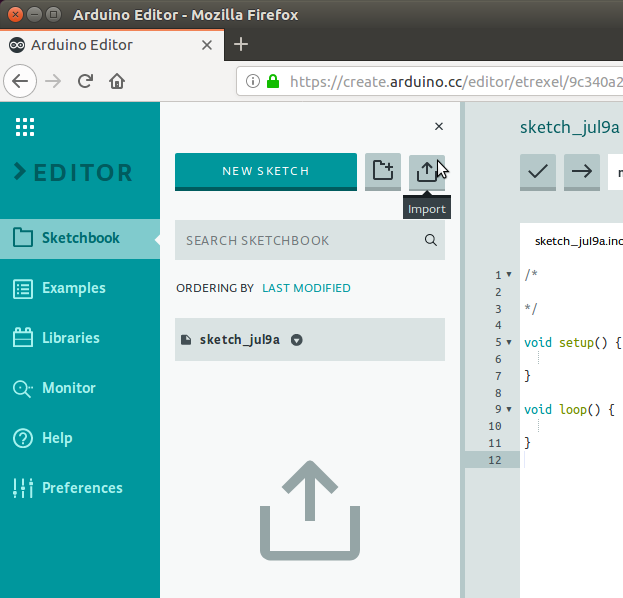
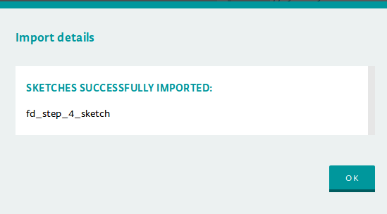
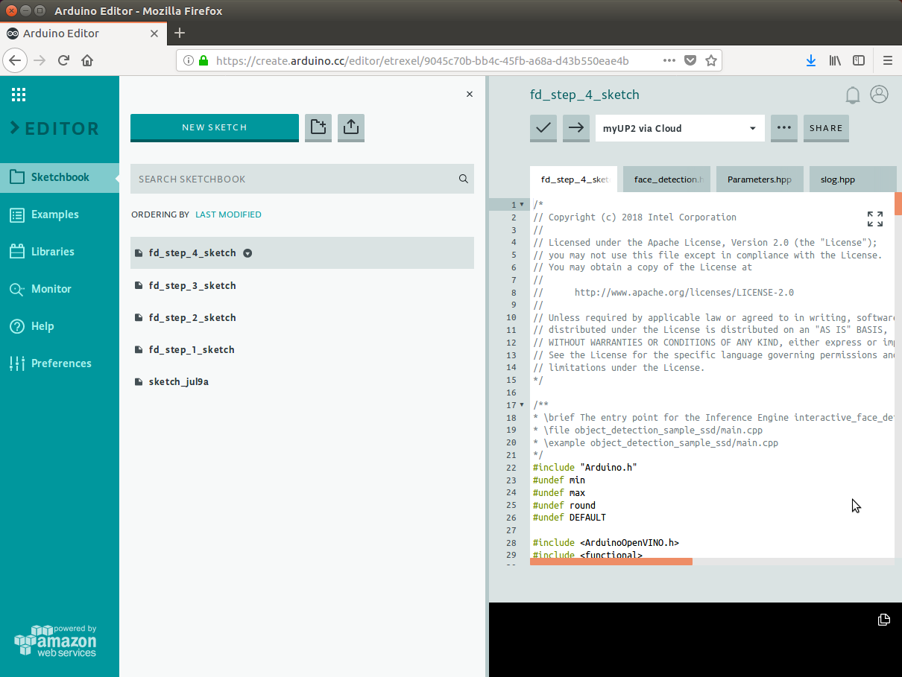
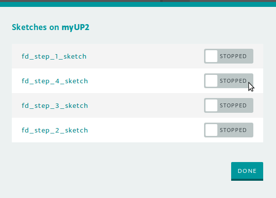
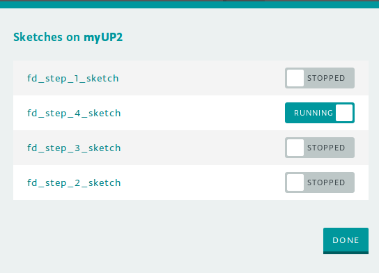
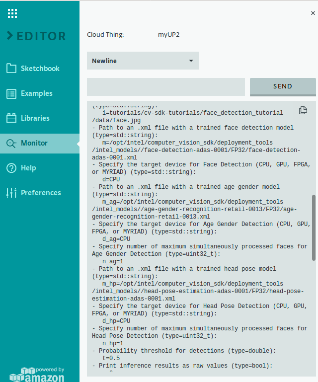
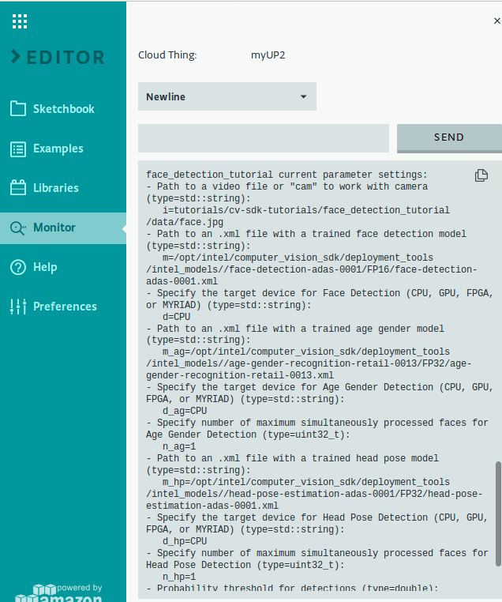
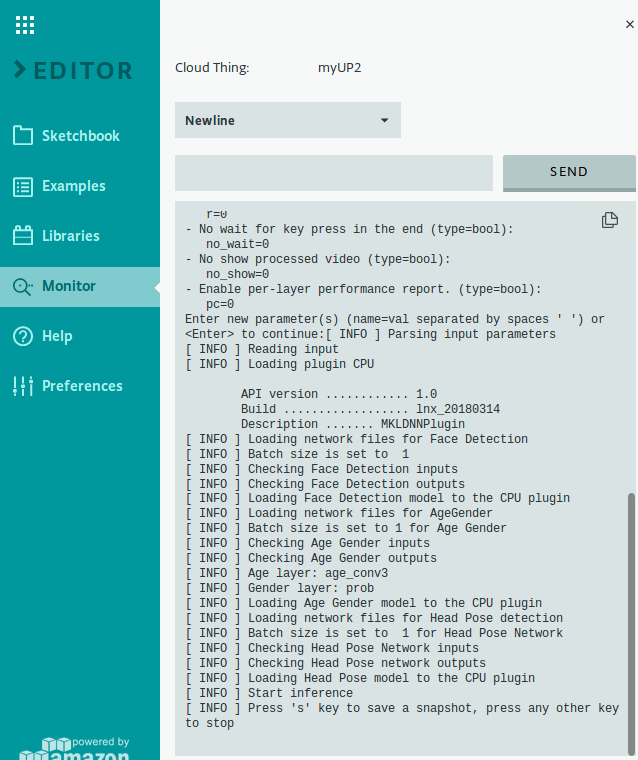

# Tutorial Step 4: Adding a third model, Head Pose Estimation


# Table of Contents

<p></p><div class="table-of-contents"><ul><li><a href="#tutorial-step-4-adding-a-third-model-head-pose-estimation">Tutorial Step 4: Adding a third model, Head Pose Estimation</a></li><li><a href="#table-of-contents">Table of Contents</a></li><li><a href="#introduction">Introduction</a></li><li><a href="#head-pose-estimation-model">Head Pose Estimation Model</a></li><li><a href="#adding-the-head-pose-estimation-model">Adding the Head Pose Estimation Model</a><ul><li><a href="#headposedetection">HeadPoseDetection</a><ul><li><a href="#headposedetection">HeadPoseDetection()</a></li><li><a href="#submitrequest">submitRequest()</a></li><li><a href="#enqueue">enqueue()</a></li><li><a href="#read">read()</a></li><li><a href="#buildcameramatrix">buildCameraMatrix()</a></li><li><a href="#drawaxes">drawAxes()</a></li></ul></li></ul></li><li><a href="#using-headposedetection">Using HeadPoseDetection</a><ul><li><a href="#main-function">main_function()</a></li><li><a href="#main-loop">Main Loop</a></li><li><a href="#post-main-loop">Post-Main Loop</a></li></ul></li><li><a href="#building-and-running">Building and Running</a><ul><li><a href="#build">Build</a><ul><li><a href="#start-arduino-create-web-editor">Start Arduino Create Web Editor</a></li><li><a href="#import-arduino-create-sketch">Import Arduino Create Sketch</a></li><li><a href="#build-and-upload-sketch-executable">Build and Upload Sketch Executable</a></li></ul></li><li><a href="#run">Run</a><ul><li><a href="#how-to-run-the-executable">How to Run the Executable</a></li><li><a href="#how-to-set-runtime-parameters">How to Set Runtime Parameters</a></li><li><a href="#running">Running</a></li></ul></li></ul></li><li><a href="#picking-the-right-models-for-the-right-devices">Picking the Right Models for the Right Devices</a><ul><li><a href="#what-determines-the-device-a-model-uses">What Determines the Device a Model Uses?</a></li><li><a href="#how-do-i-choose-the-specific-device-to-run-a-model">How Do I Choose the Specific Device to Run a Model?</a></li><li><a href="#are-there-models-that-cannot-be-loaded-onto-specific-devices">Are There Models That Cannot be Loaded onto Specific Devices?</a></li><li><a href="#are-some-devices-faster-than-others">Are Some Devices Faster Than Others?</a></li><li><a href="#are-some-devices-better-for-certain-types-of-models-than-other-devices">Are Some Devices Better for Certain Types of Models Than Other Devices?</a><ul><li><a href="#all-the-parameters">All the Parameters</a></li><li><a href="#what-kind-of-performance-should-i-see">What Kind of Performance Should I See?</a><ul><li><a href="#runtime-parameter-settings">Runtime Parameter Settings</a></li></ul></li></ul></li></ul></li><li><a href="#conclusion">Conclusion</a></li><li><a href="#navigation">Navigation</a></li></ul></div><p></p>

# Introduction

In Face Detection Tutorial Step 4, the final inference model will be added.  The model estimates the head pose based on the face image it is given.  The same detected face results from the face detection model used in Tutorial Step 3 for the age and gender model are used for head pose estimation.  After the head pose model has processed the face, the application will draw a set of axes over the face, indicating the Yaw, Pitch, and Roll orientation of the head.  A sample output showing the results where the three axes appears below.  The metrics reported now also include the time to run the head pose model.


In the image above, the three axes intersect in the center of the head.  The blue line represents Roll, and it extends from the center of the head to the front and the back of the head.  The red line represents Pitch, and is drawn from the center of the head to the left ear.  The green line represents Yaw, and is drawn from the center of the head to the top of the head.

# Head Pose Estimation Model

The OpenVINO™ toolkit includes a pre-compiled model for estimating head pose from an image of a face.  You can find it at:

* /opt/intel/computer_vision_sdk/deployment_tools/intel_models/head-pose-estimation-adas-0001

   * Available model locations:

      * FP16: /opt/intel/computer_vision_sdk/deployment_tools/intel_models/head-pose-estimation-adas-0001/FP16/head-pose-estimation-adas-0001.xml

      * FP32: /opt/intel/computer_vision_sdk/deployment_tools/intel_models/head-pose-estimation-adas-0001/FP32/head-pose-estimation-adas-0001.xml

   * More details can be found at:

      * file:///opt/intel/computer_vision_sdk/deployment_tools/intel_models/head-pose-estimation-adas-0001/description/head-pose-estimation-adas-0001.html

The results it is capable of producing are shown in the summary below (for more details, see the descriptions HTML pages for each model): 

<table>
  <tr>
    <td>Model</td>
    <td>GFLOPS</td>
    <td>MParameters</td>
    <td>Average Precision</td>
  </tr>
  <tr>
    <td>head-pose-estimation-adas-0001</td>
    <td>0.0343</td>
    <td>0.92</td>
    <td>Angle: Mean ± standard deviation of absolute error
Yaw: 5.4 ± 4.4
Pitch: 5.5 ± 5.3
Roll: 4.6 ± 5.6</td>
  </tr>
</table>


# Adding the Head Pose Estimation Model

As we saw in Tutorial Step 3, adding a new model is a relatively straight forward process.  To add another model is just a matter of deriving a new class for head pose estimation, add a new command line parameter, updating the application to run and track statistics for the new model, and then finally take those results and overlay them on the face.  Let us walkthrough the source code used to accomplish that.

1. Open up a terminal (such as xterm) or use an existing terminal to get to a command shell prompt.

2. Change to the directory containing Tutorial Step 4:

```bash
cd tutorials/face_detection_tutorial/step_4
```


3. Open the files "main.cpp" and “face_detection.hpp” in the editor of your choice such as ‘gedit’, ‘gvim’, or ‘vim’.

## HeadPoseDetection 

1. The HeadPoseDetection class is derived from BaseDetection, and the member variables it uses are declared.

```cpp
struct HeadPoseDetection : BaseDetection {
    std::string input;
    std::string outputAngleR = "angle_r_fc";
    std::string outputAngleP = "angle_p_fc";
    std::string outputAngleY = "angle_y_fc";
    int enquedFaces = 0;
    cv::Mat cameraMatrix;
```


2. The Result class is created to store the information that the model will return, specifically, the roll, pitch, and yaw for each head pose.

```cpp
    struct Results {
        float angle_r;
        float angle_p;
        float angle_y;
    };
```


3. The operator[] function is defined to give a convenient way to retrieve the head pose results from the data contained in the inference request’s output blob.  The index to the appropriate locations in the blob is calculated for the batch item.  Then, a result object containing the data read for the batch index is returned.

```cpp
    Results operator[] (int idx) const {
        auto  angleR = request->GetBlob(outputAngleR);
        auto  angleP = request->GetBlob(outputAngleP);
        auto  angleY = request->GetBlob(outputAngleY);
        return {angleR->buffer().as<float*>()[idx],
                angleP->buffer().as<float*>()[idx],
                angleY->buffer().as<float*>()[idx]};
    }
```


### HeadPoseDetection()

On construction of a HeadPoseDetection object, the base class constructor is called passing in the model to load specified in the command line argument PARAMETERS_m_hp, the name to be used when we printing out informational messages, and set the batch size to the command line argument FLAFS_n_hp.  This initializes the BaseDetection subclass specifically for HeadPoseDetection.

```cpp
    HeadPoseDetection() : BaseDetection(PARAMETERS_m_hp, "Head Pose", PARAMETERS_n_hp) {}
```


### submitRequest()

The submitRequest() function is overridden to make sure that there are faces queued up to be processed.  If so, call the base class submitRequest() function to start inferring head pose from the enqueued faces.  enquedFaces is reset to 0 indicating that all the queued data has been submitted.

```cpp
    void submitRequest() override {
        if (!enquedFaces) return;
        BaseDetection::submitRequest();
        enquedFaces = 0;
    }
```


### enqueue()

A check is made to see that the head pose detection model is enabled.  A check is also made to make sure that the number of inputs does not exceed the batch size.  

```cpp
   void enqueue(const cv::Mat &face) {
        if (!enabled()) {
            return;
        }
        if (enquedFaces == maxBatch) {
            slog::warn << "Number of detected faces more than maximum(" << maxBatch << ") processed by Head Pose detector" << slog::endl;
            return;
        }
```


An inference request object is created if one has not been already created.  The request object is used for holding input and output data, starting inference, and waiting for completion and results.

```cpp
        if (!request) {
            request = net.CreateInferRequestPtr();
        }
```


The input blob from the request is retrieved and then matU8ToBlob() is used to copy the image image data into the blob.

```cpp
        auto  inputBlob = request->GetBlob(input);

        if (matU8ToBlob<float>(face, inputBlob, 1.0f, enquedFaces)) {
        	enquedFaces++;
        }
    }
```


### read()

The next function we will walkthrough is the HeadPoseDetection::read() function which must be specialized specifically to the model that it will load and run. 

```cpp
    CNNNetwork read() override {
```


1. The Inference Engine API InferenceEngine::CNNNetReader object is used to load the model IR files.  This comes from the XML file that is specified on the command line using the "-m_hp" parameter.  

```cpp
        slog::info << "Loading network files for Head Pose detection " << slog::endl;
        InferenceEngine::CNNNetReader netReader;
        /** Read network model **/
        netReader.ReadNetwork(PARAMETERS_m_hp);
```


2. The maximum batch size is set to maxBatch (set using PARAMETERS_n_hp which defaults to 1).

```cpp
        /** Set batch size to maximum currently set to one provided from command line **/
        netReader.getNetwork().setBatchSize(maxBatch);
        slog::info << "Batch size is set to  " << netReader.getNetwork().getBatchSize() << " for Head Pose Network" << slog::endl;
```


3. The IR .bin file of the model is read.

```cpp
        std::string binFileName = fileNameNoExt(PARAMETERS_m_hp) + ".bin";
        netReader.ReadWeights(binFileName);
```


4. The proper number of inputs is checked to make sure that the loaded model has only one input as expected.

```cpp
        slog::info << "Checking Head Pose Network inputs" << slog::endl;
        InferenceEngine::InputsDataMap inputInfo(netReader.getNetwork().getInputsInfo());
        if (inputInfo.size() != 1) {
            throw std::logic_error("Head Pose topology should have only one input");
        }
```


5. The input data format is prepared by configuring it for the proper precision (FP32 = 32-bit floating point) and memory layout (NCHW) for the model.

```cpp
        auto& inputInfoFirst = inputInfo.begin()->second;
        inputInfoFirst->setPrecision(Precision::FP32);
        inputInfoFirst->getInputData()->setLayout(Layout::NCHW);
        input = inputInfo.begin()->first;
```


6. The model is verified to have the three output layers as expected for the roll, pitch and yaw results.  A map is created and initialized to hold the output names to receive the results from the model.

```cpp
        slog::info << "Checking Head Pose network outputs" << slog::endl;
        InferenceEngine::OutputsDataMap outputInfo(netReader.getNetwork().getOutputsInfo());
        if (outputInfo.size() != 3) {
            throw std::logic_error("Head Pose network should have 3 outputs");
        }
        std::map<std::string, bool> layerNames = {
            {outputAngleR, false},
            {outputAngleP, false},
            {outputAngleY, false}
        };
```


7. A check is made to make sure that the model has the three output layers named as expected and their types are as expected.

```cpp
        for (auto && output : outputInfo) {
            auto layer = output.second->getCreatorLayer().lock();
            if (layerNames.find(layer->name) == layerNames.end()) {
                throw std::logic_error("Head Pose network output layer unknown: " + layer->name + ", should be " +
                    outputAngleR + " or " + outputAngleP + " or " + outputAngleY);
            }
            if (layer->type != "FullyConnected") {
                throw std::logic_error("Head Pose network output layer (" + layer->name + ") has invalid type: " +
                    layer->type + ", should be FullyConnected");
            }
            auto fc = dynamic_cast<FullyConnectedLayer*>(layer.get());
            if (fc->_out_num != 1) {
                throw std::logic_error("Head Pose network output layer (" + layer->name + ") has invalid out-size=" +
                    std::to_string(fc->_out_num) + ", should be 1");
            }
            layerNames[layer->name] = true;
        }
```


8. Where the model will be loaded is logged, the model is marked as being enabled, and the InferenceEngine::CNNNetwork object containing the model is returned.

```cpp
        slog::info << "Loading Head Pose model to the "<< PARAMETERS_d_hp << " plugin" << slog::endl;

        _enabled = true;
        return netReader.getNetwork();
    }
```


### buildCameraMatrix()

```cpp
buildCameraMatrix(int cx, int cy, float focalLength)
```


buildCameraMatrix() is a utility function that is used to create a "camera" that is looking at the image.  It provides the perspective to use during position calculations.

### drawAxes()

```cpp
drawAxes(cv::Mat& frame, cv::Point3f cpoint, Results headPose, float scale)
```


drawAxes() is a utility function that is used to create the Yaw, Pitch and Roll axes object that will be drawn for each face on the output image.  It uses standard math and trigonometry to determine how the three axes appear when viewed from the camera, and then draws the axes over the face.

# Using HeadPoseDetection

## main_function()

That takes care of specializing the BaseDetector class into the Head PoseDetection class for the head pose detection model.  We now move down into the main_function() function to see what additions have been made to use the head pose detection model to process detected faces.

1. In the main() function, the command line arguments PARAMETERS_d_hp and PARAMETERS_m_hp are added to cmdOptions.  Remember that the flags are defined in the face_detection.hpp file.

```cpp
std::vector<std::pair<std::string, std::string>> cmdOptions = {
   {PARAMETERS_d, PARAMETERS_m}, {PARAMETERS_d_ag, PARAMETERS_m_ag}, {PARAMETERS_d_hp, PARAMETERS_m_hp}
};
```


2. The head pose detection object is instantiated.

```cpp
HeadPoseDetection HeadPose;
```


3. The model is loaded into the Inference Engine and associate it with the device using the Load helper class previously covered.

```cpp
Load(HeadPose).into(pluginsForDevices[PARAMETERS_d_hp]);
```


## Main Loop

In the main "while(true)" loop, the inference results from the face detection model are used as input to the head pose detection model.  

1. The loop to iterate through the fetched results is started.  The loop will infer faces in batches until all have been inferred.  The vector headPoseResults is used to store the head pose results while headPoseFaceIdx tracks the index of the next face to infer and headPoseNumFacesInferred tracks how many faces have been inferred.  headPoseNumFacesToInfer is set to the number of faces to be inferred which is always 0 if not enabled.

```Cpp
            // fetch all face results
            FaceDetection.fetchResults();

            //...AgeGender code...

            // track and store head pose results for all faces
            std::vector<HeadPoseDetection::Results> headPoseResults;
            int headPoseFaceIdx = 0;
            int headPoseNumFacesInferred = 0;
            int headPoseNumFacesToInfer = HeadPose.enabled() ? FaceDetection.results.size() : 0;

            while((ageGenderFaceIdx < ageGenderNumFacesToInfer)
        		   || (headPoseFaceIdx < headPoseNumFacesToInfer)) {
```


2. A loop to enqueue a batch of faces is begun if there are faces still to infer and continues until either the batch is full (maxBatch) or there are no more faces to infer.

```Cpp
            	// enqueue input batch
            	//...AgeGender code...
            	while ((headPoseFaceIdx < headPoseNumFacesToInfer) && (HeadPose.enquedFaces < HeadPose.maxBatch)) {
```


3. Get the ROI for the face by clipping the face location from the input image frame.

```cpp
				FaceDetectionClass::Result faceResult = FaceDetection.results[headPoseFaceIdx];
				auto clippedRect = faceResult.location & cv::Rect(0, 0, width, height);
				auto face = frame(clippedRect);
```


4. If the age and gender model is enabled, enqueue the face and increment ageGenderFaceIdx to the next face index.

```cpp
				HeadPose.enqueue(face);
				headPoseFaceIdx++;
            	}
```


5. The start time is stored in t0 and if there are faces enqueued, start inference for the batch.  Note that by starting both before waiting for results, the age and gender model is run in parallel with the head pose model.

```Cpp
			t0 = std::chrono::high_resolution_clock::now();

            	if (AgeGender.enquedFaces > 0) {
				AgeGender.submitRequest();
            	}

            	// if faces are enqueued, then start inference
            	if (HeadPose.enquedFaces > 0) {
            		HeadPose.submitRequest();
            	}
```


6. If inference of a batch of faces has begun, then wait for the results.

```cpp
            	// if there are outstanding results, then wait for inference to complete
                  //...AgeGender code...
            	if (headPoseNumFacesInferred < headPoseFaceIdx) {
            		HeadPose.wait();
            	}
```


7. Record the end time of inference in t1 and accumulate the total time of all batches in secondDetection.  Note that the time is for both models.

```Cpp
			t1 = std::chrono::high_resolution_clock::now();
			secondDetection += std::chrono::duration_cast<ms>(t1 - t0).count();
```


8. If there are inference results, loop through them storing in ageGenderResults to be rendered later.

```Cpp
			// process results if there are any
                  //...AgeGender code...
			if (headPoseNumFacesInferred < headPoseFaceIdx) {
				for(int ri = 0; ri < HeadPose.maxBatch; ri++) {
					headPoseResults.push_back(HeadPose[ri]);
					headPoseNumFacesInferred++;
            		}
            	}
```


9. The timing metrics for inference are output with the results for the head pose inference added to the output window.

```cpp
if (HeadPose.enabled() || AgeGender.enabled()) {
   out.str("");
   out << (AgeGender.enabled() ? "Age Gender"  : "")
       << (AgeGender.enabled() && HeadPose.enabled() ? "+"  : "")
       << (HeadPose.enabled() ? "Head Pose "  : "")
       << "time: "<< std::fixed << std::setprecision(2) 
       << secondDetection
       << " ms ";
   if (!FaceDetection.results.empty()) {
      out << "(" << 1000.f / secondDetection << " fps)";
   }
   cv::putText(frame, out.str(), cv::Point2f(0, 65),
      cv::FONT_HERSHEY_TRIPLEX, 0.5, cv::Scalar(255, 0, 0));
}
```


10. The output image is updated with the head pose results for each detected face by drawing the yaw, pitch, and roll axes over the face.

```cpp
if (HeadPose.enabled()) {
   cv::Point3f center(rect.x + rect.width / 2, rect.y + rect.height / 2, 0);
   HeadPose.drawAxes(frame, center, headPoseResults[ri], 50);
}
```


## Post-Main Loop

The head pose detection object is added to display the performance count information. 

```cpp
if (PARAMETERS_pc) {
   FaceDetection.printPerformanceCounts();
   AgeGender.printPerformanceCounts();
   HeadPose.printPerformanceCounts();
}
```


# Building and Running

Now that we have looked at the code and understand how the program works, let us compile and run to see it in action.  

## Build

### Start Arduino Create Web Editor

If you do not already have a web browser open, open one such as the Firefox browser from the desktop or from a command line ("firefox &").  Once open, browse to the Arduino website [https://create.arduino.cc/](https://create.arduino.cc/) to begin.

### Import Arduino Create Sketch

1. After going to the Arduino website which should appear similar to below, open the Arduino Web Editor by clicking it.


2. When the editor is first opened, it will show your last opened sketch and appear similar to below.


3. To begin to import this tutorial’s sketch, click on the up-arrow icon (hovering tooltip will say "Import") to the right of the “NEW SKETCH” button as shown below.



4. A "File Upload" window will appear, use it to browse to where the tutorials have been downloaded and select the file “face_detection_tutorial/step_4/fd_step_4_sketch.zip”, and then click the Open button.  After uploading and importing successfully, you will see a window similar to below.  Click the OK button to continue.



5. With the sketch now imported, it will be open in the editor similar to below and you are now ready to build.  



### Build and Upload Sketch Executable

1. From the Arduino Create Web Editor you build the executable and then upload it to your Arduino device.  After uploading, the executable with the same name as the sketch may be found in the "sketches" directory under your user’s home directory and may be run directly from the command line later if desired.  Before continuing, be sure that your device is ready as indicated in the box which will show “\<device name\> via Cloud” when connected as shown below for the device named “myUP2”. 


2. If unconnected and not ready, the device will appear with a line with red ‘X’ before the name as shown below.  To reconnect, you may need to refresh or reload the browser page, restart the Arduino Create Agent, or potentially run setup for your kit again.


3. After making sure your device is connected, to begin the build and upload process click on the right-arrow icon at the top of the editor as shown below.


4. During the build and upload process, you will see that the button has been replaced with "BUSY" as shown below along with status text at the bottom of the window saying “Updating \<sketch name\>”.


5. Below shows after a successful build and upload.  Note that the bottom of the editor will be updated with the status and below it the output of the build.  


6. Uploading will also start the sketch which you can verify by checking the status of the sketch by clicking the "RUN/STOP" button as shown below.


7. The status window will show all the sketches that have been uploaded to the device and the state of each as a "switch" similar below showing either “RUNNING” or “STOPPED”.  Clicking the switch will change the state of the sketch.  


8. For now, we will stop the sketch before continuing.  First click the "RUNNING" to change it to “STOPPED”, then click the DONE button to close the window.  **Note**: Be sure to run only one tutorial sketch at a time to avoid overloading your device which may make it very slow or unresponsive.


## Run

### How to Run the Executable

1. Before starting a sketch, you will need to grant the root user access to the X server to open X windows by executing the following xhost command:

```Bash
xhost +si:localuser:root 
```


2. From the command you should see the following response.  Note the xhost command will need to be run again after rebooting Linux.

```Bash
localuser:root being added to access control list
```


3. After uploading the sketch, it can be started and stopped without re-uploading.  To control and check the status of the sketch, click the "RUN/STOP" button as shown below.


4. The sketch status window will appear with a "switch" to the right of each sketch indicating RUNNING or STOPPED as shown below already STOPPED.  



5. Clicking the RUNNING or STOPPED will change the status between states.  When starting a tutorial exercise, be sure the sketch is stopped first and then start it running.  With the sketch STOPPED, we now click it to change it to RUNNING, then click the DONE button to close the window.  **Note**: Be sure to run only one tutorial sketch at a time to avoid overloading your device which may make it very slow or unresponsive.



### How to Set Runtime Parameters

For flexibility and to minimize rebuilding and re-uploading the sketch when parameters change, the tutorial code allows setting parameters at runtime.  When the sketch first starts, it will first display all the current settings and then prompt for a parameters string before continuing.  Note that the sketch must first stop (or be stopped) and then restarted before accepting new parameter settings.  The steps below go through an example to set the image input parameter "i=\<video filename\>".

1. Open the "Monitor" view by clicking “Monitor” at the left side of the Arduino Create Web Editor.  The monitor is effectively the console for the sketch.  The large box will display output (stdout) from the sketch while the box to the left of the SEND button is used to send input (stdin) to the sketch.  **Note**: Be sure to open the monitor before starting the sketch otherwise you may not see initial output during startup displayed.


2. Stop the sketch if running, then start it again.  The Monitor view should now show the prompt for new parameters similar to below.  Note that each parameter is shown with a description first ("Path to a video file…"), the type of input (“sid::string”), then the current setting as name=val (“i=cam”)..  


3. To change parameters, enter a string "name=val" for each parameter with a space ‘ ‘ between each “name=val”.  To change the video input file, we might use something like “i=tutorials/cv-sdk-tutorials/face_detection_tutorial/data/face.jpg” and press Enter or click the SEND button.  The parameters are displayed again with the new setting and a new prompt as shown below.  Note that relative paths are relative to the the user’s home directory where sketches are run.



4. You may notice that default value for the parameter "m" is pretty long and may need to change especially when wanting to use an FP16 model for a device.  To make this easier, included in the tutorial “car_detection.hpp” code are additional parameters: “mFDA32” and “mFDA16”.  Instead of copying the full path, the parameter string’s ability to reference other parameters may be used such as “m=$mFDA16” which will change parameter “m” to now point to the FP16 version of the model as shown below.



5. When ready to run the sketch with the current parameter settings, leave the input box empty and press Enter or click the SEND button.  The sketch should continue with more output shown in the monitor output box similar to below.



### Running

1. You now have the executable file to run.  In order to load the head pose detection model, the "m_hp" parameter needs to be added followed by the full path to the model.  First, let us see how it works on a single image file.  Use the parameter settings string:

```
m=$mFDA32 m_ag=$mAG32 m_hp=$mHP32 i=tutorials/cv-sdk-tutorials/face_detection_tutorial/data/face.jpg
```


2. The output window will show the image overlaid with colored rectangles over the faces, age and gender results for each face, and the timing statistics for computing the results.  Additionally, you will see red, green, and blue axes over each face, representing the head pose, or orientation, for the face.  Next, let us try it on a video file.  Use the parameter settings string:

```
m=$mFDA32 m_ag=$mAG32 m_hp=$mHP32 i=/opt/intel/computer_vision_sdk/openvx/samples/samples/face_detection/face.mp4
```


3. You will see rectangles and the head pose axes that follow the faces around the image (if the faces move), accompanied by age and gender results for the faces, and the timing statistics for processing each frame of the video.  Finally, let us see how it works for camera input.  The camera is the default source, so we do this by running the application without using any parameters or we can still specify the camera using "cam" by using the parameter settings string:

```
m=$mFDA32 m_ag=$mAG32 m_hp=$mHP32 i=cam
```


4. Again, you will see colored rectangles drawn around any faces that appear in the images along with the results for age, gender, the axes representing the head poses, and the various render statistics.

# Picking the Right Models for the Right Devices

Throughout this tutorial, we just had the application load the models onto the default CPU device.  Here we will explore using the other devices included in the UP Squared* AI Vision Development Kit, the GPU and Myriad.  That brings up several questions that we should discuss to get a more complete idea of how to make the best use of our models and how to optimize the applications using the devices available.

## What Determines the Device a Model Uses?

One of the main factors is going to be the floating point precision that the model requires.  We discuss that below, to answer the question "Are there models that cannot be loaded onto certain devices?"

Another major factor is speed.  Depending on how the model is structured, compiled and optimized, it may lend itself to running faster on a certain device.  Sometimes, you may know that.  Other times, you may have to test the model on different devices to determine where it runs best.

The other major factor in determining where to load a model is parallel processing or load balancing required to meet an application’s performance requirements.  

Once you have made those decisions, you can use the command line arguments to have the application assign the models to the particular device you want them to run on to test and verify.

## How Do I Choose the Specific Device to Run a Model?

In the application, we use command line parameters to specify which device to use for the models we load.  These are "-d", “-d_ag” and “-d_hp”, and they are used for the face detection model, age and gender estimation model, and head pose estimation model, respectively.  The available devices are “CPU”, “GPU” and “MYRIAD” that come with the UP Squared* AI Vision Development Kit.

## Are There Models That Cannot be Loaded onto Specific Devices?

Yes.  The main restriction is the precision of the model must be supported by the device.  As we discussed in the Key Concepts section, certain devices can only run models that have the matching floating point precision.  For example, the CPU can only run models that use FP32 precision.  This is because the hardware execution units of the CPU are designed and optimized for FP32 operations.  Similarly, the Myriad can only load models that use FP16 precision.  While the GPU is designed to be more flexible to run both FP16 and FP32 models, though it runs FP16 models faster than FP32 models.

## Are Some Devices Faster Than Others?

The easy answer is "yes."  The more complex answer is that it can be more complex than just “which device is fastest / has the fastest clock speed / and the most cores?”  Some devices are better at certain functions than other devices because of hardware optimizations or internal structures that fit the work being done within a particular model.  As noted previously, devices that can work with models running FP16 can run faster just because they are moving around as little as half the data of when running FP32.

## Are Some Devices Better for Certain Types of Models Than Other Devices?

Again, the easy answer is "yes."  The truth is that it can be difficult to know what model will run best on what device without actually loading the model on a device and seeing how it performs.  This is one of the most powerful features of the Inference Engine and the OpenVINO™ toolkit.  It is very easy to write applications that allow you to get up and running quickly to test many combinations of models and devices, without requiring significant code changes or even recompiling.  Our face detection application can do exactly that.  So let us see what we can learn about how these models work on different devices by running through the options.

### All the Parameters

Before we can get started, let us go over the command line parameters again.  We specify the model we want to load by using the "m*" parameters, which device to load using the “d*” parameters, and batch size using the “-n*” parameters.  The table below summarizes the parameters for all three models.

<table>
  <tr>
    <td>Model</td>
    <td>Model Parameter</td>
    <td>Device Parameter</td>
    <td>Batch Size Parameter</td>
  </tr>
  <tr>
    <td>Face detection</td>
    <td>m</td>
    <td>d</td>
    <td>(none, always set to 1)</td>
  </tr>
  <tr>
    <td>Age and gender</td>
    <td>m_ag</td>
    <td>d_ag</td>
    <td>n_ag</td>
  </tr>
  <tr>
    <td>Head pose</td>
    <td>m_hp</td>
    <td>d_hp</td>
    <td>n_hp</td>
  </tr>
</table>


As we mentioned in the Key Concepts section, the batch size is the number of input data that the models will work on.  For the face detection model, the batch size is fixed to 1.  Even when processing input from a video or a camera, it will only processes a single image/frame at a time.  Depending on the content of the image data, it can return any number of faces.  The application lets us set the batch size on the other models dynamically and the default batch size is 1 for the age and gender and head pose models.  This will work for the Myriad which has a maximum batch size of 1.  Since we are not expecting many results in the test video provided, to simplify things and keep batch size from affecting performance results (something covered in the Car Detection Tutorial), we will use the default batch size of 1 for all models.

Let us look at a sample parameter settings string that uses all the parameters so that we can see what it looks like.

```
m=$mFDA32 d=GPU m_ag=$mAG16 d_ag=MYRIAD m_hp=$mHP16 d_hp=GPU i=/opt/intel/computer_vision_sdk/openvx/samples/samples/face_detection/face.mp4
```


From this command line, we see that the application will load the FP32 face detection model onto the GPU, the FP16 age and gender model on the Myriad, using a batch size of 1, and the FP16 head pose model onto the GPU, with a batch size of 16.  We also specify "-i /opt/intel/computer_vision_sdk/openvx/samples/samples/face_detection/face.mp4" so that we have a “known” data set to do our performance tests with.  This MP4 video file used from the OpenVINO™ toolkit samples is a hand-drawn face with a moving camera.  

You can see that it is easy to change the model precision to match the device you want to run it on by changing the model to use the FP16 or FP32 using "16" and “32” built into the names of the variables..  It is easy to make up several test cases to see how the application and each of the inference model, perform.  Just remember that all models run on the CPU must be FP32, and all models run on the Myriad must be FP16.  Models run on the Myriad must also have their batch size set to 1.  Models run on the GPU can be either FP16 or FP32.

### What Kind of Performance Should I See?

That depends on many things, from the specific combination of models and devices that you specified, to the other applications running on the development kit while you collect data.  There are are also different versions of the UP Squared* board, with different CPU and GPU hardware.  So the exact data will vary from what appears in the chart below, however the general trends should be the same.  That said, let us take a look at some of the performance counts we observed.  

The performance reported in milliseconds and using the "wallclock*" and “totalFramse” variables in the code that time the main loop.  When the application exits, it reports the wallclock time and average time and FPS of main loop for the input image source used.

Below are ten command lines we used to generate some performance count data.  These do not cover all the possible combinations, but these do give a good indication of the top performance trends for each of the models on the different devices.  

#### Runtime Parameter Settings

```
# Parameter settings string #1
m=$mFDA16 d=MYRIAD m_ag=$mAG16 d_ag=GPU m_hp=$mHP32 d_hp=CPU i=/opt/intel/computer_vision_sdk/openvx/samples/samples/face_detection/face.mp4
# Parameter settings string #2
m=$mFDA16 d=MYRIAD m_ag=$mAG32 d_ag=CPU m_hp=$mHP16 d_hp=GPU i=/opt/intel/computer_vision_sdk/openvx/samples/samples/face_detection/face.mp4
# Parameter settings string #3
m=$mFDA16 d=MYRIAD m_ag=$mAG16 d_ag=GPU m_hp=$mHP32 d_hp=GPU i=/opt/intel/computer_vision_sdk/openvx/samples/samples/face_detection/face.mp4
# Parameter settings string #4
m=$mFDA32 d=CPU m_ag=$mAG32 d_ag=CPU m_hp=$mHP32 d_hp=CPU i=/opt/intel/computer_vision_sdk/openvx/samples/samples/face_detection/face.mp4
# Parameter settings string #5
m=$mFDA32 d=CPU m_ag=$mAG32 d_ag=CPU m_hp=$mHP32 d_hp=GPU i=/opt/intel/computer_vision_sdk/openvx/samples/samples/face_detection/face.mp4
# Parameter settings string #6
m=$mFDA32 d=CPU m_ag=$mAG16 d_ag=MYRIAD m_hp=$mHP16 d_hp=MYRIAD i=/opt/intel/computer_vision_sdk/openvx/samples/samples/face_detection/face.mp4
# Parameter settings string #7
m=$mFDA16 d=GPU m_ag=$mAG32 d_ag=CPU m_hp=$mHP32 d_hp=CPU i=/opt/intel/computer_vision_sdk/openvx/samples/samples/face_detection/face.mp4
# Parameter settings string #8
m=$mFDA32 d=CPU m_ag=$mAG16 d_ag=GPU m_hp=$mHP32 d_hp=MYRIAD i=/opt/intel/computer_vision_sdk/openvx/samples/samples/face_detection/face.mp4
# Parameter settings string #9
m=$mFDA32 d=CPU m_ag=$mAG16 d_ag=GPU m_hp=$mHP16 d_hp=MYRIAD i=/opt/intel/computer_vision_sdk/openvx/samples/samples/face_detection/face.mp4
# Parameter settings string #10
m=$mFDA32 d=GPU m_ag=$mAG32 d_ag=CPU m_hp=$mHP32 d_hp=GPU i=/opt/intel/computer_vision_sdk/openvx/samples/samples/face_detection/face.mp4
# Parameter settings string #11
m=$mFDA16 d=GPU m_ag=$mAG16 d_ag=MYRIAD m_hp=$mHP32 d_hp=CPU i=/opt/intel/computer_vision_sdk/openvx/samples/samples/face_detection/face.mp4
# Parameter settings string #12
m=$mFDA32 d=CPU m_ag=$mAG16 d_ag=GPU m_hp=$mHP16 d_hp=GPU i=/opt/intel/computer_vision_sdk/openvx/samples/samples/face_detection/face.mp4
# Parameter settings string #13
m=$mFDA32 d=GPU m_ag=$mAG16 d_ag=MYRIAD m_hp=$mHP16 d_hp=MYRIAD i=/opt/intel/computer_vision_sdk/openvx/samples/samples/face_detection/face.mp4
# Parameter settings string #14
m=$mFDA16 d=GPU m_ag=$mAG32 d_ag=CPU m_hp=$mHP16 d_hp=MYRIAD i=/opt/intel/computer_vision_sdk/openvx/samples/samples/face_detection/face.mp4
# Parameter settings string #15
m=$mFDA16 d=GPU m_ag=$mAG16 d_ag=MYRIAD m_hp=$mHP16 d_hp=MYRIAD i=/opt/intel/computer_vision_sdk/openvx/samples/samples/face_detection/face.mp4
# Parameter settings string #16
m=$mFDA16 d=GPU m_ag=$mAG16 d_ag=GPU m_hp=$mHP16 d_hp=GPU i=/opt/intel/computer_vision_sdk/openvx/samples/samples/face_detection/face.mp4
```


Performance is measured as the average time for the main loop to process all the input frames.  The average time, and inverse as frames-per-second (fps), with number of frames processed are reported on exit.  The results seen for the configurations listed above should improve starting from the first all the way to the last.  From the list, we can see several trends:  

* Performance is generally faster on the GPU than on the CPU.  

* FP16 performance is almost always faster than FP32 performance on any device.

* Depending upon which model it runs, the Myriad shows up in the fastest and slowest performance numbers.  This is likely due to the device being connected by USB for data transfers instead of being directly connected to main system memory like the CPU and GPU.  This means that more time needs to be spent moving data back and forth across a slower connection, and the more data moved, the slower it is.  We can infer that models that require significant amounts of data to process would be better run on the CPU or GPU, while models that work on modest amounts of data can be handled well by the Myriad.

In general, the best way to maximize performance is to put the most complex model on the fastest device.  Try to divide the work across the devices as much as possible to avoid overloading any one device.  If you do not need FP32 precision, you can speed up your applications by using FP16 models.

For this application, we see that the best performance is when all models are run on the GPU.  The next best is when the face detection model is run on the GPU entirely, and the age and gender and head pose models are run on the Myriad.  

Something to note too is that the Myriad is only capable of running two analysis models at a time.  If you try to load a third model, the application will exit, and report a "Device not found" error.

# Conclusion

By adding the head pose estimation model to the application from Tutorial Step 3, you have now seen the final step in assembling the full application.  This again shows the power the OpenVINO™ toolkit brings to applications by quickly being able to add another inference model.  We also discussed how to load the inference models onto different devices to distribute the workload and find the optimal device to get the best performance from the models.

# Navigation

[Face Detection Tutorial](../Readme.md)

[Face Detection Tutorial Step 3](../step_3/Readme.md)

